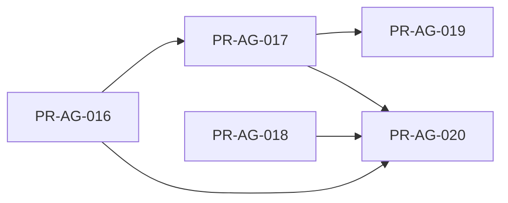

# Purpose Reminder Agent Stage 4 Ticket Backlog

## 1. 사용 방법
- Stage 4는 "구현 공백 메우기" 단계다. 탐색은 완료되었고, 아래 체크리스트 순서대로 구현하면 된다.
- 상태가 `READY`인 티켓만 실행한다.
- 실기기/Capability/Signing 이슈는 즉시 `BLOCKED_MANUAL`로 전환하고 BM 코드를 남긴다.

## 2. 공통 전제
- 코드 기준선: 2026-03-04
- 선행 탐색 완료 파일
  - `App/AppRouter.swift`
  - `Features/SessionStart/SessionStartView.swift`
  - `Features/PolicySettings/PolicySettingsView.swift`
  - `Features/History/HistoryView.swift`
  - `Core/Services/Session/SessionCoordinator.swift`
  - `Core/Services/Session/ReminderScheduler.swift`
  - `Extensions/ShieldActionExtension/ShieldActionExtension.swift`
  - `Extensions/DeviceActivityMonitorExtension/DeviceActivityMonitorExtension.swift`

## 3. 실행 순서
1. `PR-AG-016` (브리지 소비/라우팅 기초)
2. `PR-AG-017` (SessionActive 종료 액션과 cold-start 복구)
3. `PR-AG-018` (GoalTemplates + 정책 기본 템플릿)
4. `PR-AG-019` (timeout 자동화, 017의 복구 API 재사용)
5. `PR-AG-020` (알림 액션 lifecycle, 017의 복구 API 재사용)

## 4. 시각화 (백로그 관점)

### 4-1. 실행 순서와 병렬 가능 구간

### 4-2. 티켓-파일 영향 맵

```mermaid
flowchart TD
    T16["PR-AG-016"] --> F1["App/AppRouter.swift"]
    T16 --> F2["Core/Services/ScreenTime/ShieldRouteInboxService.swift"]
    T16 --> F3["Core/Shared/Constants.swift"]

    T17["PR-AG-017"] --> F4["Features/SessionActive/SessionActiveView.swift"]
    T17 --> F5["Core/Services/Session/SessionCoordinator.swift"]
    T17 --> F6["Features/SessionStart/SessionStartView.swift"]

    T18["PR-AG-018"] --> F7["Features/GoalTemplates/GoalTemplatesView.swift"]
    T18 --> F8["Features/PolicySettings/PolicySettingsView.swift"]
    T18 --> F6

    T19["PR-AG-019"] --> F9["Extensions/DeviceActivityMonitorExtension/DeviceActivityMonitorExtension.swift"]
    T19 --> F10["Core/Services/Session/SessionTimeoutInboxService.swift"]
    T19 --> F1

    T20["PR-AG-020"] --> F11["Core/Services/Notification/NotificationActionHandler.swift"]
    T20 --> F12["App/PurposeReminderApp.swift"]
    T20 --> F3
    T20 --> F5
```

## 5. Stage 4

## [PR-AG-016] ShieldRoute 소비 및 앱 라우팅 연결
- 상태: `READY`
- 목표: ShieldActionExtension이 기록한 `shield.lastEvent`를 Main App에서 consume-once로 소비해 세션 진입 라우팅을 수행한다.
- 선행 조건: PR-AG-006, PR-AG-009
- 입력 문서: `docs/ios-stage4-execution-roadmap.md`, `docs/tickets/PR-AG-016-plan.md`
- 주요 변경 파일:
  - `Core/Shared/Constants.swift`
  - `Core/Services/ScreenTime/ShieldRouteInboxService.swift` (신규)
  - `App/AppRouter.swift`
  - `PurposeReminderTests/ShieldRouteInboxServiceTests.swift` (신규)
  - `PurposeReminderTests/AppRouterViewModelTests.swift` (신규)
- 실행 단계:
1. App Group route 이벤트 디코드/소비 서비스 작성
2. AppRouter에 탭 선택 상태 + route poll 연결
3. malformed/중복 이벤트 방어 로직 추가
- 검증:
  - route consume-once 테스트
  - 라우팅 상태 테스트
- 완료 기준:
  - `startGoalSelection` 이벤트 1회 소비 후 세션 탭으로 이동
  - 재실행 시 동일 이벤트 재소비 없음
- 중단 조건 (사람 개입 필요):
  - `BM-016-01`: App Group 미설정으로 공유 UserDefaults 접근 불가
- 수동 작업:
  - 실기기에서 Shield primary 버튼 -> 앱 라우팅 확인

## [PR-AG-017] SessionActive 화면 및 종료 액션 구현
- 상태: `READY`
- 목표: active 세션 진행 화면과 완료/연장/중단 액션을 구현하고, 앱 재실행 후에도 종료 액션이 동작하도록 복구 경로를 만든다.
- 선행 조건: PR-AG-008, PR-AG-010
- 입력 문서: `docs/ios-stage4-execution-roadmap.md`, `docs/tickets/PR-AG-017-plan.md`
- 주요 변경 파일:
  - `Features/SessionActive/SessionActiveView.swift` (교체)
  - `Core/Services/Session/SessionCoordinator.swift`
  - `Features/SessionStart/SessionStartView.swift`
  - `PurposeReminderTests/SessionActiveViewModelTests.swift` (신규)
  - `PurposeReminderTests/SessionCoordinatorTests.swift` (보강)
- 실행 단계:
1. SessionActiveViewModel에서 active 세션 조회 + 카운트다운 표시
2. `SessionCoordinator`에 active 세션 attach/restore API 추가
3. 완료/연장/중단 액션 연결 및 UI 진입 동선 연결
- 검증:
  - ViewModel 액션 3종 테스트
  - cold-start attach 후 종료 액션 테스트
- 완료 기준:
  - 액션 수행 후 `GoalSession.status`가 기대값으로 저장
  - active 세션이 없을 때 안전한 empty 상태 표시
- 중단 조건 (사람 개입 필요): 없음
- 수동 작업:
  - 실기기에서 세션 종료 UX(완료/연장/중단) 확인

## [PR-AG-018] GoalTemplates 화면 및 정책 기본 템플릿 연결
- 상태: `READY`
- 목표: 템플릿 CRUD/즐겨찾기 화면을 구현하고 정책 화면에서 `defaultTemplateId`를 선택/저장할 수 있게 한다.
- 선행 조건: PR-AG-007, PR-AG-011
- 입력 문서: `docs/ios-stage4-execution-roadmap.md`, `docs/tickets/PR-AG-018-plan.md`
- 주요 변경 파일:
  - `Features/GoalTemplates/GoalTemplatesView.swift` (교체)
  - `Features/PolicySettings/PolicySettingsView.swift`
  - `Features/SessionStart/SessionStartView.swift` (템플릿 관리 진입 동선)
  - `PurposeReminderTests/GoalTemplatesViewModelTests.swift` (신규)
  - `PurposeReminderTests/PolicySettingsViewModelTests.swift` (신규)
- 실행 단계:
1. GoalTemplates 목록/생성/수정/삭제/즐겨찾기 구현
2. 정책 draft에 기본 템플릿 picker 연결
3. 저장 시 `defaultTemplateId` 유효성 검증 및 정리
- 검증:
  - 템플릿 CRUD 단위 테스트
  - 정책 저장 시 defaultTemplateId 보존 테스트
- 완료 기준:
  - 템플릿 화면에서 CRUD와 즐겨찾기 동작
  - 정책 재진입 시 defaultTemplateId 복원
- 중단 조건 (사람 개입 필요): 없음
- 수동 작업: 없음

## [PR-AG-019] DeviceActivityMonitorExtension 타임아웃 처리 구현
- 상태: `READY`
- 목표: DeviceActivity timeout 이벤트를 Main App으로 전달하고 active 세션을 자동으로 `timed_out` 처리한다.
- 선행 조건: PR-AG-006, PR-AG-017
- 입력 문서: `docs/ios-stage4-execution-roadmap.md`, `docs/tickets/PR-AG-019-plan.md`
- 주요 변경 파일:
  - `Extensions/DeviceActivityMonitorExtension/DeviceActivityMonitorExtension.swift` (교체)
  - `Core/Services/Session/SessionTimeoutInboxService.swift` (신규)
  - `App/AppRouter.swift` 또는 lifecycle 처리 지점
  - `PurposeReminderTests/SessionTimeoutInboxServiceTests.swift` (신규)
  - `PurposeReminderTests/SessionTimeoutFlowTests.swift` (신규)
- 실행 단계:
1. Extension에서 timeout 이벤트를 App Group에 기록
2. Main App에서 consume-once 후 active 세션 timeout 처리
3. 중복 처리/active 세션 없음 케이스 방어
- 검증:
  - timeout 이벤트 consume 테스트
  - timeout 상태 저장 테스트
- 완료 기준:
  - timeout 이벤트 소비 시 세션이 `timed_out`으로 저장
  - 기록 화면에서 시간초과 집계 반영
- 중단 조건 (사람 개입 필요):
  - `BM-019-01`: DeviceActivity capability/실기기 extension 검증 불가
- 수동 작업:
  - 실기기에서 DeviceActivity interval 종료 후 timeout 반영 확인

## [PR-AG-020] 알림 액션 파이프라인 구현
- 상태: `READY`
- 목표: 알림 응답을 처리해 `ReminderEvent.action`과 세션 종료 액션을 일관되게 기록한다.
- 선행 조건: PR-AG-010, PR-AG-017
- 입력 문서: `docs/ios-stage4-execution-roadmap.md`, `docs/tickets/PR-AG-020-plan.md`
- 주요 변경 파일:
  - `Core/Shared/Constants.swift`
  - `Core/Services/Notification/NotificationActionHandler.swift` (신규)
  - `App/PurposeReminderApp.swift`
  - `PurposeReminderTests/NotificationActionHandlerTests.swift` (신규)
- 실행 단계:
1. Notification category/action 등록
2. `UNUserNotificationCenterDelegate` 브리지 구현
3. 액션별 `ReminderAction` 매핑 + 세션 액션(완료/연장) 연동
- 검증:
  - 액션 매핑 테스트
  - userInfo 파싱 실패 안전 테스트
  - complete/extend 반영 테스트
- 완료 기준:
  - `ignored/opened/completed/extended` 저장 정확성 확보
  - malformed payload에서도 크래시 없음
- 중단 조건 (사람 개입 필요):
  - `BM-020-01`: 실기기 알림 액션 수동 테스트 불가
- 수동 작업:
  - 실기기에서 알림 본문 탭/완료/연장/닫기 액션 확인
