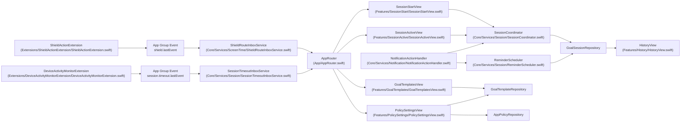
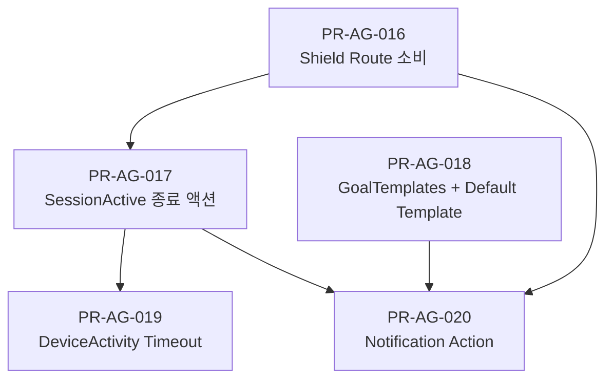
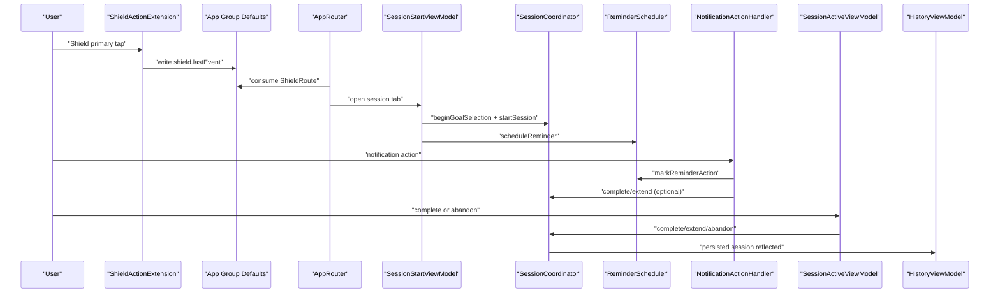
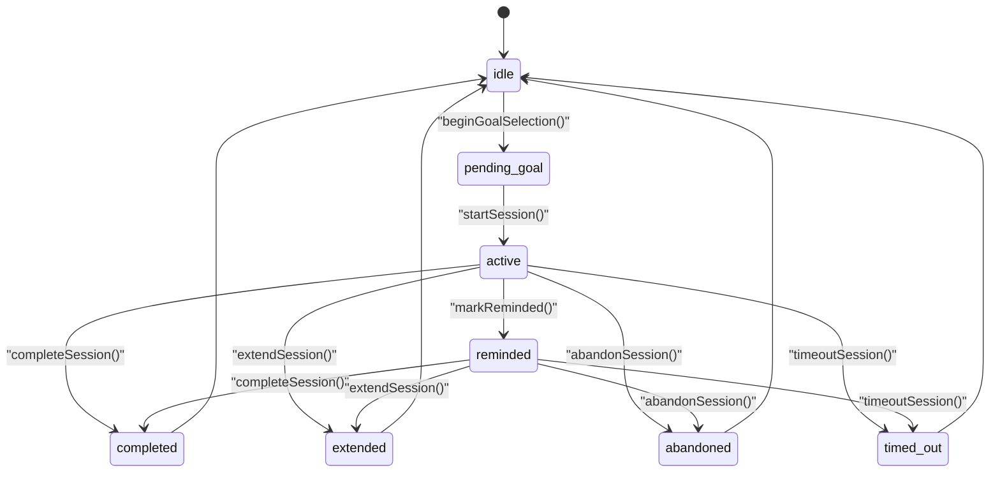

# Purpose Reminder iOS Stage 4 Execution Roadmap

## 1. 목적
- Stage 3 이후 남은 구현 갭을 닫아 실제 폐루프(Shield -> SessionStart -> SessionActive -> 종료/타임아웃 -> 기록/알림 반영)를 완성한다.
- 이 문서는 2026-03-04 기준 코드베이스 실탐색 결과를 반영한 "구현 직전 문서"다.

## 2. 코드베이스 기준선 (2026-03-04)

### 2-1. 이미 구현된 기반
- 세션 상태 전이 엔진: `Core/Services/Session/SessionCoordinator.swift`
- 리마인드 스케줄링/이벤트 기록: `Core/Services/Session/ReminderScheduler.swift`
- 세션 시작 추천/정책 연결: `Features/SessionStart/SessionStartRecommendationViewModel.swift`
- 기록 집계 화면: `Features/History/HistoryView.swift`
- 정책 저장/Shield 적용: `Features/PolicySettings/PolicySettingsView.swift`, `Core/Services/ScreenTime/ShieldPolicyService.swift`
- Shield 액션 이벤트 기록(Extension): `Extensions/ShieldActionExtension/ShieldActionExtension.swift`

### 2-2. 현재 갭 (Stage 4 대상)
- 플레이스홀더 화면
  - `Features/GoalTemplates/GoalTemplatesView.swift`
  - `Features/SessionActive/SessionActiveView.swift`
- 플레이스홀더 Extension
  - `Extensions/DeviceActivityMonitorExtension/DeviceActivityMonitorExtension.swift`
- App Group 브리지 미완성
  - `shield.lastEvent`를 Main App이 소비해 라우팅하는 경로가 없음
  - DeviceActivity timeout 이벤트를 Main App으로 전달하는 채널이 없음
- 알림 액션 lifecycle 미완성
  - 카테고리 등록/응답 처리 delegate/ReminderEvent.action 갱신 경로 없음
- 세션 "콜드 스타트 복구" 미완성
  - 앱 재실행 후 `SessionCoordinator.state`가 `.idle`로 시작되어 active 세션 종료 액션 연결이 약함

## 3. Stage 4 범위
1. Shield route 소비 + 앱 라우팅 연결
2. SessionActive 화면/뷰모델 + 완료/연장/중단 액션
3. GoalTemplates CRUD + Policy default template 선택
4. DeviceActivity timeout 이벤트 브리지 + `timed_out` 저장
5. Notification 액션(열기/완료/연장/무시) 처리 + `ReminderEvent.action` 반영

## 4. 아키텍처 확장 원칙
- 단일 저장소 원칙 유지: 세션/리마인드 최종 상태 저장은 `GoalSessionRepository` 경유
- 브리지 consume-once: App Group 이벤트는 소비 후 즉시 삭제해 중복 처리 방지
- 콜드 스타트 허용: 앱이 재기동되어도 active 세션을 복구해 종료 액션 실행 가능해야 함
- 수동 이슈 격리: Signing/Capability/실기기 이슈는 BM 코드로 분리하고 코드 구현은 계속 진행

## 5. 파일 단위 변경 매트릭스
| 티켓 | 파일 | 변경 유형 | 핵심 변경 |
|---|---|---|---|
| PR-AG-016 | `App/AppRouter.swift` | 수정 | 탭 선택 상태 + Shield route 소비 파이프라인 |
| PR-AG-016 | `Core/Services/ScreenTime/ShieldRouteInboxService.swift` | 신규 | App Group route decode/consume-once |
| PR-AG-016 | `Core/Shared/Constants.swift` | 수정 | App Group suite/key 상수 공통화 |
| PR-AG-017 | `Features/SessionActive/SessionActiveView.swift` | 교체 | SessionActiveView + ViewModel + 카운트다운/종료 액션 |
| PR-AG-017 | `Core/Services/Session/SessionCoordinator.swift` | 수정 | active 세션 attach/restore API |
| PR-AG-017 | `Features/SessionStart/SessionStartView.swift` | 수정 | SessionActive 진입 동선 |
| PR-AG-018 | `Features/GoalTemplates/GoalTemplatesView.swift` | 교체 | 템플릿 CRUD/즐겨찾기/필터 UI |
| PR-AG-018 | `Features/PolicySettings/PolicySettingsView.swift` | 수정 | defaultTemplateId 선택/저장 |
| PR-AG-019 | `Extensions/DeviceActivityMonitorExtension/DeviceActivityMonitorExtension.swift` | 교체 | timeout 이벤트 기록 |
| PR-AG-019 | `Core/Services/Session/SessionTimeoutInboxService.swift` | 신규 | timeout 이벤트 소비/적용 |
| PR-AG-020 | `App/PurposeReminderApp.swift` | 수정 | Notification category 등록 + delegate 브리지 |
| PR-AG-020 | `Core/Services/Notification/NotificationActionHandler.swift` | 신규 | 알림 응답 파싱/ReminderEvent 반영/세션 액션 연계 |
| PR-AG-020 | `Core/Shared/Constants.swift` | 수정 | action identifier 확장 |

## 6. 실행 순서 (탐색 완료 기준)
1. `PR-AG-016` 먼저 완료해 App Group 라우팅 소비 인프라를 고정한다.
2. `PR-AG-017`에서 SessionActive UI와 active 세션 attach API를 완성한다.
3. `PR-AG-018`을 병렬로 진행해 템플릿 CRUD와 정책 기본 템플릿을 연결한다.
4. `PR-AG-019`에서 timeout 브리지를 추가하고 017의 attach API를 재사용한다.
5. `PR-AG-020`에서 notification lifecycle을 마무리하고 ReminderEvent/action까지 폐루프를 닫는다.

## 7. Gate 기준
- Gate S4-1: Shield primary 버튼 이후 3초 내 세션 탭 진입(자동/수동 라우팅)
- Gate S4-2: SessionActive에서 완료/연장/중단 수행 시 `GoalSession.status` 반영
- Gate S4-3: timeout 이벤트 소비 시 active 세션이 `timed_out`으로 저장
- Gate S4-4: 알림 액션 수행 후 `ReminderEvent.action`이 기대값(`ignored/opened/completed/extended`)으로 저장
- Gate S4-5: 기록 화면 집계(`completed/extended/abandoned/timedOut`)가 상태 변화를 즉시 반영

## 8. 테스트 전략

### 자동 테스트 목표 (최소 10개)
- PR-AG-016: route decode/consume/idempotent + router state 테스트
- PR-AG-017: active 세션 로드/카운트다운/complete-extend-abandon 테스트
- PR-AG-018: 템플릿 CRUD/중복 방지/defaultTemplateId 저장 테스트
- PR-AG-019: timeout 이벤트 consume/active 세션 timed_out 전환 테스트
- PR-AG-020: notification action 매핑/파싱/실패 안전 테스트

### 수동 테스트 목표
- `docs/e2e-mvp-checklist.md`의 E2E-03/04/05를 Stage 4 기준으로 재실행
- 실기기 전용 검증은 `docs/ios-manual-setup-checklist.md` BM 코드로 기록

## 9. Stage 4 완료 기준 (DoD)
1. 플레이스홀더 3개(GoalTemplates/SessionActive/DeviceActivityMonitor) 제거
2. Stage 4 신규 자동 테스트 10개 이상 통과
3. 실기기 수동 검증 결과 또는 BM 코드 기록
4. 문서 동기화 완료
   - `docs/agent-stage4-ticket-backlog.md`
   - `docs/tickets/PR-AG-016~020-plan.md`
   - 필요 시 `docs/e2e-mvp-checklist.md`, `docs/ios-manual-setup-checklist.md`

## 10. BLOCKED_MANUAL 운영
- BM 코드는 티켓별로 독립 관리한다. 하나의 BM 발생이 Stage 4 전체 중단을 의미하지 않는다.
- Capability/Signing/실기기 이슈는 즉시 `BLOCKED_MANUAL`로 전환하고, 코드 구현 가능한 티켓은 `READY`로 병렬 진행한다.

## 11. 통합 시각화 (코드베이스 기준)

### 11-1. Stage 4 컴포넌트 맵

### 11-2. 티켓 의존 그래프

### 11-3. 폐루프 시퀀스 (완료 상태)

### 11-4. 세션 상태 전이 (Stage 4 확장 반영)

