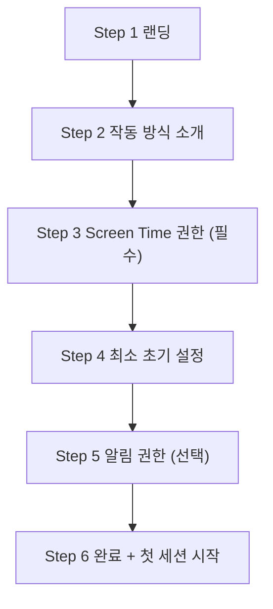
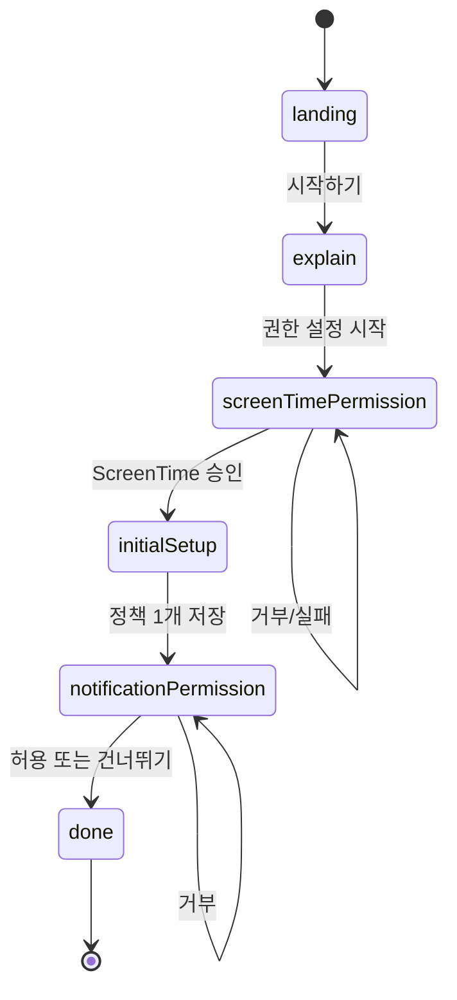

# Purpose Reminder 온보딩/권한 UX 실행계획

## 1. 문서 목적
- 이 문서는 랜딩 페이지와 온보딩 권한 플로우를 실제 개발/디자인/QA 작업으로 바로 옮기기 위한 실행 기준서다.
- 기준 우선순위는 다음과 같다.
1. Screen Time 핵심 기능 성공률
2. 온보딩 이탈률 감소
3. 첫 세션 시작 전환율 상승

## 2. 이번 개선의 목표 (2주)
1. 온보딩 완료율을 현재 대비 개선한다.
2. Screen Time 권한 허용률을 최대화한다.
3. 알림 권한을 선택화해 초기 이탈을 줄인다.
4. 온보딩 완료 후 첫 세션 시작 전환을 강화한다.

정량 목표(1차 가설):
1. 온보딩 완료율: +15%p
2. Screen Time 허용률: +10%p
3. 첫 세션 시작 전환율: +20%p

## 3. 현재 문제 정의
1. 권한 요청이 첫 화면부터 시작되어 사용자 맥락이 부족하다.
2. 알림 권한이 필수 게이트로 동작해 이탈을 유발한다.
3. 거부 후 복구 동선(설정 이동/복귀 안내)이 약하다.
4. 단계 진행감이 없어 사용자가 남은 과정을 예측하기 어렵다.

## 4. To-Be 온보딩 플로우

게이트 규칙:
1. `Screen Time == approved`여야 메인 진입 가능
2. `Notification`은 미허용이어도 메인 진입 가능
3. Step 4는 최소 정책 1개 저장 시 완료

## 5. 화면별 상세 스펙
| Step | 화면 목적 | 필수 UI | Primary CTA | Secondary CTA | 완료 조건 |
|---|---|---|---|---|---|
| 1 랜딩 | 가치 이해 | 헤드라인, 핵심 카드 3개, 진행표시 1/6 | 시작하기 | 작동 방식 보기 | CTA 탭 |
| 2 소개 | 동작 방식 이해 | 4단계 흐름 카드 | 권한 설정 시작 | 뒤로 | CTA 탭 |
| 3 Screen Time | 필수 권한 획득 | 사전설명 3줄, 상태라벨, 요청버튼 | Screen Time 허용 | 설정에서 열기(거부 시) | status=approved |
| 4 초기 설정 | 즉시 가치 체감 | 대상 앱 선택, 기본시간 설정 | 다음 | 뒤로 | 정책 1개 저장 |
| 5 알림 | 리마인드 활성화 | 알림 가치 설명, 요청 버튼 | 알림 켜기 | 지금은 건너뛰기 | 허용 또는 건너뜀 |
| 6 완료 | 첫 행동 유도 | 완료 메시지, 요약정보 | 첫 목표로 시작 | 정책 화면으로 이동 | CTA 탭 |

## 6. 권한 화면 상태 규칙
### 6.1 Screen Time 카드
1. `notDetermined`: 버튼 `권한 요청`
2. `denied`: 버튼 `설정에서 허용`
3. `approved`: 버튼 `허용 완료`(비활성)

표시 문구:
1. 왜 필요한가: 등록 앱 진입 전 목표 선택을 보여주기 위함
2. 언제 사용하는가: 사용자가 등록 앱을 열려고 할 때만
3. 무엇을 수집하지 않는가: 메시지/콘텐츠 본문

### 6.2 Notification 카드
1. `notDetermined`: 버튼 `알림 켜기`
2. `denied`: 버튼 `설정에서 허용`
3. `authorized`: 버튼 `허용 완료`(비활성)

정책:
1. 알림은 온보딩 진행 차단 금지
2. 추후 설정 화면에서 재활성화 가능

## 7. 상태 머신 정의

## 8. 2주 실행 일정 (권장)
### Week 1
1. Day 1: UX 와이어 확정, 카피 확정, 이벤트 스키마 정의
2. Day 2: `OnboardingStep` 상태 머신 구현
3. Day 3: Screen Time 권한 단계 구현 및 거부 복구 액션 구현
4. Day 4: 초기 설정 단계 연결(대상 앱 선택 + 기본 시간)
5. Day 5: 알림 선택 단계/완료 단계 구현, 내부 QA 1차

### Week 2
1. Day 6: UI 디테일(진행표시, 모션, 접근성 라벨)
2. Day 7: 이벤트 로깅/퍼널 대시보드 연결
3. Day 8: 실패 케이스 보강(재진입, 설정 복귀, 취소)
4. Day 9: 통합 QA/실기기 테스트/문서 업데이트
5. Day 10: 릴리즈 체크 및 배포

## 9. 구현 작업 분해 (티켓 단위)
### OB-01 온보딩 단계 상태 머신 도입
- 변경 파일:
1. `PurposeReminder/Features/Onboarding/OnboardingView.swift`
2. `PurposeReminder/App/AppRouter.swift`
- 작업:
1. `OnboardingStep` enum 추가
2. 단일 화면을 step 기반 렌더링으로 분리
3. progress indicator(1/6) 추가
- 완료 기준:
1. Step 전환이 정상 동작
2. 기존 권한 상태 snapshot과 충돌 없음

### OB-02 권한 게이트 조건 분리
- 변경 파일:
1. `PurposeReminder/Core/Services/ScreenTime/AuthorizationService.swift`
2. `PurposeReminder/App/AppRouter.swift`
- 작업:
1. 메인 진입 조건을 `Screen Time 승인` 중심으로 변경
2. 알림은 비차단 상태로 분리
- 완료 기준:
1. 알림 거부 상태에서도 메인 진입 가능
2. Screen Time 미허용 시 온보딩 유지

### OB-03 Screen Time 권한 단계 고도화
- 변경 파일:
1. `PurposeReminder/Features/Onboarding/OnboardingView.swift`
- 작업:
1. 사전설명 3줄 UI 추가
2. 거부/실패 시 `설정에서 허용` 액션 제공
3. 권한 상태 라벨 즉시 업데이트
- 완료 기준:
1. 권한 승인/거부/실패 케이스 모두 가시화

### OB-04 최소 초기 설정 단계 연결
- 변경 파일:
1. `PurposeReminder/Features/Onboarding/OnboardingView.swift`
2. `PurposeReminder/Features/PolicySettings/PolicySettingsView.swift` (재사용 범위)
- 작업:
1. 대상 앱 최소 1개 선택
2. 기본 사용 시간 저장
- 완료 기준:
1. 정책 1개 저장 전에는 다음 단계 비활성

### OB-05 알림 선택 단계/완료 단계 구현
- 변경 파일:
1. `PurposeReminder/Features/Onboarding/OnboardingView.swift`
- 작업:
1. 알림 허용 또는 건너뛰기 분기
2. 완료 화면과 첫 행동 CTA 연결
- 완료 기준:
1. 허용/건너뛰기 모두 Step 6으로 이동

### OB-06 이벤트 로깅/퍼널 분석
- 변경 파일:
1. `PurposeReminder/Core/Shared/Logger.swift`
2. 온보딩 관련 ViewModel 파일
- 작업:
1. 단계 진입/이탈/권한 결과 이벤트 기록
2. 퍼널 계산 가능한 프로퍼티 정의
- 완료 기준:
1. 단계별 전환율 계산 가능

## 10. 이벤트 로깅 스펙
| 이벤트명 | 트리거 | 필수 속성 |
|---|---|---|
| `onboarding_step_viewed` | Step 화면 진입 | `step`, `timestamp` |
| `onboarding_step_next_tapped` | 다음 CTA 탭 | `step`, `cta` |
| `screen_time_permission_requested` | Screen Time 요청 버튼 탭 | `step` |
| `screen_time_permission_result` | 요청 완료 | `result(approved/denied/not_determined)`, `error` |
| `notification_permission_requested` | 알림 요청 버튼 탭 | `step` |
| `notification_permission_result` | 요청 완료 | `result(authorized/denied/not_determined)` |
| `onboarding_completed` | Step 6 완료 | `screen_time_status`, `notification_status` |
| `first_session_start_tapped` | 완료 CTA 탭 | `source=onboarding_done` |

## 11. QA 테스트 시나리오
1. 신규 설치 -> 전체 Step 완주
2. Screen Time 거부 -> 설정 이동 -> 복귀 후 승인
3. Screen Time notDetermined 유지(팝업 취소) -> 재요청
4. 알림 거부 -> 건너뛰기 -> 메인 진입
5. 알림 미요청 -> 메인 진입 후 설정에서 허용
6. 최소 초기 설정에서 앱 미선택 시 CTA 비활성
7. 기본 시간 경계값(1분, 180분) 저장 확인
8. 앱 재실행 시 완료 Step 재노출 여부 확인
9. 다국어/긴 문구에서 레이아웃 깨짐 확인
10. VoiceOver 라벨/버튼 순서 점검

## 12. 릴리즈 게이트
1. 빌드/테스트 실패 0건
2. 온보딩 핵심 시나리오 QA 10건 통과
3. 이벤트 로그 누락 0건
4. 실기기에서 Screen Time 권한 승인 플로우 재현 성공

## 13. 리스크와 대응
1. 리스크: Screen Time 권한 팝업 미노출
- 대응: 실기기/Capability 점검 가이드와 에러 힌트 문구 고정
2. 리스크: 알림 허용률 저하
- 대응: 첫 세션 시작 직전 재노출 전략 A/B 테스트
3. 리스크: Step 증가로 온보딩 길어짐
- 대응: Step 2를 스킵 가능한 경량 버전으로 실험

## 14. 즉시 실행 순서
1. OB-01, OB-02 먼저 구현해 게이트 조건을 안정화한다.
2. OB-03, OB-04로 핵심 가치 체감 구간을 연결한다.
3. OB-05, OB-06 후 QA/로그 검증을 완료한다.

---
이 계획은 2026년 3월 4일 기준 초안이며, 1차 사용자 테스트 결과에 따라 카피/단계 수/권한 요청 시점을 조정한다.
