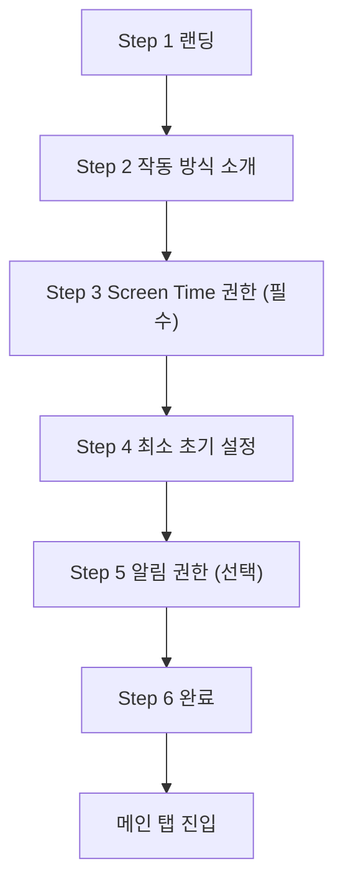
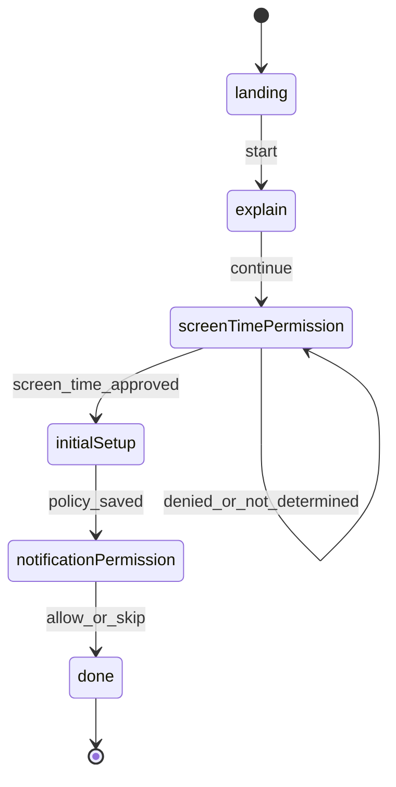

# Purpose Reminder 온보딩/권한 리디자인 에이전트 실행 플레이북

## 0. 이 문서의 사용법
- 이 문서는 사람용 설명 문서가 아니라, 코딩 에이전트가 바로 구현을 시작할 수 있게 설계한 실행 지시서다.
- 본 문서만 전달받은 에이전트가 맥락 손실 없이 작업할 수 있도록 파일 경로, 구현 순서, 검증 명령, 실패 처리, 완료 기준을 포함한다.
- 원칙: "추측 최소화, 단계 분할, 검증 우선, 회귀 방지".

### 0.1 권장 사용 순서
1. `1~4장`을 읽고 제약/아키텍처를 고정한다.
2. `5장`에서 작업 범위(OB-00~OB-12)를 확정한다.
3. 각 작업 단위를 순차 수행하고, `6장` 검증 명령을 매 단계 실행한다.
4. 실패 시 `7장` 대응 규칙으로 복구한다.
5. 최종 산출물은 `8장` 체크리스트를 모두 만족해야 한다.

### 0.2 이 문서가 해결하려는 문제
1. 온보딩 첫 화면부터 권한 요청이 노출되어 허용률/완료율 저하
2. `알림 권한`이 필수 게이트로 묶여 초기 이탈 가중
3. 권한 거부 후 복귀 동선 미흡
4. 단계별 진행감 부재

---

## 1. 목표와 성공 기준

## 1.1 제품 목표
- 사용자가 앱 첫 실행 후 "가치 이해 -> 필수 권한 허용 -> 최소 설정 완료 -> 첫 세션 시작"까지 끊기지 않게 만든다.

## 1.2 구현 목표
1. 온보딩을 단일 권한 리스트 화면에서 단계형 플로우로 재구성
2. Screen Time은 필수, Notification은 선택으로 게이트 분리
3. 거부/실패 상태에서 설정 이동 복구 경로 추가
4. 첫 실행 가치 전달(랜딩/소개) 화면 추가
5. 퍼널 분석 가능한 로그 이벤트 추가

## 1.3 정량 목표(가설)
1. 온보딩 완료율 +15%p
2. Screen Time 권한 허용률 +10%p
3. 첫 세션 시작 전환율 +20%p

## 1.4 비목표(이번 스코프 제외)
1. 서버 분석 파이프라인 구축
2. 다국어 번역 완성
3. 디자인 시스템 전면 개편
4. 신규 추천 알고리즘 추가

---

## 2. 코드베이스 기준점 (2026-03-04)

## 2.1 현재 진입 라우팅
- 파일: `PurposeReminder/App/AppRouter.swift`
- 현재 동작:
1. `AppOnboardingState.isReadyForMainFlow`가 `true`면 `MainTabView`
2. `false`면 `OnboardingView`
3. `refresh()`에서 `AuthorizationSnapshot.isReadyForMainFlow` 값을 사용

## 2.2 현재 권한 모델
- 파일: `PurposeReminder/Core/Services/ScreenTime/AuthorizationService.swift`
- 현재 상태 타입:
1. `ScreenTimePermissionStatus`: approved/denied/notDetermined
2. `NotificationPermissionStatus`: authorized/denied/notDetermined
3. `AuthorizationSnapshot.isReadyForMainFlow = screenTime approved && notifications authorized`
- 문제:
1. 메인 진입이 알림 허용까지 요구됨

## 2.3 현재 온보딩 화면
- 파일: `PurposeReminder/Features/Onboarding/OnboardingView.swift`
- 현재 구조:
1. 권한 카드 2개를 한 화면에서 노출
2. `계속` 버튼은 `snapshot.isReadyForMainFlow` 조건으로 활성화
3. Screen Time 오류 힌트는 최소한으로 표시

## 2.4 정책 설정 재사용 가능 자산
- 파일: `PurposeReminder/Features/PolicySettings/PolicySettingsView.swift`
- 활용 포인트:
1. 앱 선택/시간 설정 로직(ViewModel) 존재
2. 온보딩 내 "최소 설정 Step" 구현 시 재사용 가능

---

## 3. 고정 제약(Non-Negotiable)

## 3.1 플랫폼 제약
1. Screen Time 권한은 실기기 환경에서만 정상 검증 가능
2. Screen Time 시스템 팝업 UI 자체는 커스텀 불가
3. 권한 거부 후 재허용은 설정 앱 이동이 필요할 수 있음

## 3.2 UX 제약
1. Screen Time은 필수 권한
2. Notification은 선택 권한
3. 사용자가 온보딩 단계 수를 인지할 수 있어야 함(진행 표시 필수)
4. 모든 단계는 Primary CTA가 1개로 명확해야 함

## 3.3 코드 제약
1. 기존 Repository/Service 구조를 우선 재사용
2. 온보딩 리팩터링은 뷰 단 분리보다 상태 모델 분리를 먼저 수행
3. 라우팅 조건 변경 시 회귀 방지를 위해 단위 테스트 추가

## 3.4 릴리즈 제약
1. 빌드 실패 상태 배포 금지
2. 핵심 시나리오(권한 승인/거부/복귀) 수동 검증 없이 종료 금지

---

## 4. To-Be 설계 명세

## 4.1 단계형 온보딩 플로우


## 4.2 상태 머신


## 4.3 권한 게이트 규칙 (반드시 준수)
1. 메인 진입 필수 조건: `screenTime == .approved`
2. 메인 진입 비필수 조건: `notifications`
3. 알림 미허용이어도 기능 안내 배너/설정 진입 제공

## 4.4 Step별 완료 조건
| Step | 이름 | 완료 조건 | 차단 조건 |
|---|---|---|---|
| 1 | 랜딩 | 시작하기 탭 | 없음 |
| 2 | 소개 | 권한 설정 시작 탭 | 없음 |
| 3 | Screen Time | 권한 상태 approved | denied/notDetermined |
| 4 | 최소 설정 | 정책 1개 이상 저장 | 정책 0개 |
| 5 | 알림 | 허용 또는 건너뛰기 | 없음 |
| 6 | 완료 | 메인 진입 CTA 탭 | 없음 |

## 4.5 화면 공통 컴포넌트 요구사항
1. 상단 진행 인디케이터(`현재 step / 총 step`)
2. 헤더(타이틀 + 설명)
3. 본문(핵심 액션)
4. 하단 고정 CTA 영역

## 4.6 권한 카드 규격
### Screen Time 카드
- 상태 라벨: `허용됨`, `거부됨`, `미요청`
- 기본 설명 3줄:
1. 왜 필요한가
2. 언제 사용되는가
3. 수집하지 않는 정보
- 버튼 규칙:
1. notDetermined -> `권한 요청`
2. denied -> `설정에서 허용`
3. approved -> `허용 완료`(disabled)

### Notification 카드
- 상태 라벨: `허용됨`, `거부됨`, `미요청`
- 설명 2줄:
1. 종료 시점 리마인드 알림 목적
2. 언제든 설정에서 변경 가능
- 버튼 규칙:
1. notDetermined -> `알림 켜기`
2. denied -> `설정에서 허용`
3. authorized -> `허용 완료`(disabled)

---

## 5. 에이전트 실행 백로그 (OB-00 ~ OB-12)

## 5.1 작업 단위 공통 규칙
- 각 작업 완료 시 아래를 반드시 기록:
1. 변경 파일 목록
2. 실행한 검증 명령
3. 실패/리스크
4. 다음 작업 권장 1개

- 각 작업은 아래 상태 중 하나로 종료:
1. DONE
2. REVIEW
3. BLOCKED_MANUAL

- BLOCKED_MANUAL 기록 포맷:
```md
- 상태: BLOCKED_MANUAL
- 코드: BM-ONBOARDING-<번호>
- 사유:
- 수동 조치:
- 해소 조건:
```

### OB-00 사전 안전화 (필수 선행)
- 목표: 리팩터링 전 기준 동작을 확보
- 변경 파일:
1. `PurposeReminder/App/AppRouter.swift`
2. `PurposeReminder/Core/Services/ScreenTime/AuthorizationService.swift`
3. `PurposeReminder/Features/Onboarding/OnboardingView.swift`
- 작업:
1. 현재 조건/동작을 문서 코멘트로 최소 기록
2. 회귀 포인트 체크리스트 생성(코드 주석 또는 TODO)
- 완료 기준:
1. 현재 동작을 추적할 수 있는 기준 확보

### OB-01 진입 게이트 분리
- 목표: 메인 진입 조건을 Screen Time 중심으로 변경
- 변경 파일:
1. `PurposeReminder/Core/Services/ScreenTime/AuthorizationService.swift`
2. `PurposeReminder/App/AppRouter.swift`
- 상세 구현:
1. `AuthorizationSnapshot`에 `isReadyForMainFlow`를 재정의하거나 신규 프로퍼티 추가
2. 권장: `canEnterMainFlow` 신설 (`screenTime == .approved`)
3. 기존 `isReadyForMainFlow` 참조부를 점진 교체
- 테스트:
1. Snapshot 계산 테스트 추가 (`PurposeReminderTests`)
2. 알림 거부 상태에서 메인 진입 가능 여부 검증
- 완료 기준:
1. Screen Time 승인 + 알림 거부에서도 메인 진입
2. Screen Time 미승인 시 온보딩 유지

### OB-02 Onboarding Step 상태 모델 도입
- 목표: 단일 화면을 단계형 상태 머신으로 전환
- 변경 파일:
1. `PurposeReminder/Features/Onboarding/OnboardingView.swift`
2. (신규 권장) `PurposeReminder/Features/Onboarding/OnboardingStep.swift`
- 상세 구현:
1. `enum OnboardingStep: Int, CaseIterable` 정의
2. 단계 전환 함수를 ViewModel로 이동
3. `next()`, `back()`, `move(to:)` 규칙 고정
- 테스트:
1. Step 전환 단위 테스트
2. 차단 조건(step3, step4) 테스트
- 완료 기준:
1. Step 이동이 의도대로 동작
2. 권한 상태와 Step 상태 간 충돌 없음

### OB-03 Step 1 랜딩 화면 구현
- 목표: 권한 요청 전에 가치 전달
- 변경 파일:
1. `PurposeReminder/Features/Onboarding/OnboardingView.swift`
- 상세 구현:
1. 타이틀/서브타이틀/핵심 카드 3개
2. Primary CTA: `시작하기`
3. 진행 인디케이터 `1/6`
- 완료 기준:
1. 권한 UI가 Step 1에서는 노출되지 않음

### OB-04 Step 2 소개 화면 구현
- 목표: 작동 방식 이해 제공
- 변경 파일:
1. `PurposeReminder/Features/Onboarding/OnboardingView.swift`
- 상세 구현:
1. 4단계 플로우 카드(앱 선택 -> 목표 선택 -> 사용 -> 리마인드)
2. Primary CTA: `권한 설정 시작`
3. Secondary CTA: `뒤로`
- 완료 기준:
1. Step 1/2 간 왕복 정상

### OB-05 Step 3 Screen Time 단계 고도화
- 목표: 필수 권한 허용률 최적화
- 변경 파일:
1. `PurposeReminder/Features/Onboarding/OnboardingView.swift`
2. `PurposeReminder/Core/Services/ScreenTime/AuthorizationService.swift`
- 상세 구현:
1. 사전 설명 3줄 고정
2. `requestScreenTime()` 결과별 메시지 정교화
3. denied 상태에서 설정 이동 버튼 추가
- 참고 구현:
1. `UIApplication.openSettingsURLString` 사용(메인 앱 타겟)
2. Scene 기반 URL open 실패 처리
- 완료 기준:
1. 승인/거부/실패/notDetermined 케이스 모두 시각화

### OB-06 Step 4 최소 초기 설정 연결
- 목표: 권한 직후 최소 가치 체감
- 변경 파일:
1. `PurposeReminder/Features/Onboarding/OnboardingView.swift`
2. `PurposeReminder/Features/PolicySettings/PolicySettingsView.swift` (재사용 유틸 추출 가능)
3. 필요 시 신규: `PurposeReminder/Features/Onboarding/OnboardingPolicySetupView.swift`
- 상세 구현:
1. 대상 앱 1개 이상 선택
2. 기본 시간 설정
3. 저장 완료 후에만 다음 CTA 활성화
- 완료 기준:
1. 정책 0개 상태에서 Step 5 진입 차단
2. 정책 저장 성공 시 Step 5 자동/수동 진입

### OB-07 Step 5 알림 단계 선택화
- 목표: 이탈 없이 알림 활성화 유도
- 변경 파일:
1. `PurposeReminder/Features/Onboarding/OnboardingView.swift`
2. `PurposeReminder/Core/Services/ScreenTime/AuthorizationService.swift`
- 상세 구현:
1. Primary CTA: `알림 켜기`
2. Secondary CTA: `지금은 건너뛰기`
3. 거부 시 설정 이동 액션 표시
- 완료 기준:
1. 알림 거부/미요청 상태에서도 Step 6 이동 가능

### OB-08 Step 6 완료 및 첫 행동 연결
- 목표: 온보딩 완료 후 첫 세션 시작 전환
- 변경 파일:
1. `PurposeReminder/Features/Onboarding/OnboardingView.swift`
2. `PurposeReminder/App/AppRouter.swift`
- 상세 구현:
1. 완료 요약 카드(권한/정책 상태)
2. Primary CTA: 메인 진입
3. Secondary CTA: 정책 화면 이동(선택)
- 완료 기준:
1. 완료 CTA 후 메인 탭 진입 정상

### OB-09 공통 권한 카드/스텝 레이아웃 컴포넌트 분리
- 목표: 중복 제거, 유지보수성 향상
- 변경 파일:
1. 신규 권장 `PurposeReminder/Features/Onboarding/Components/PermissionCardView.swift`
2. 신규 권장 `PurposeReminder/Features/Onboarding/Components/OnboardingScaffoldView.swift`
3. `PurposeReminder/Features/Onboarding/OnboardingView.swift`
- 완료 기준:
1. OnboardingView 본문이 상태 분기 중심으로 단순화
2. 컴포넌트별 프리뷰 또는 단위 테스트 추가

### OB-10 접근성/로컬라이징 준비
- 목표: 기본 접근성 품질 확보
- 변경 파일:
1. `PurposeReminder/Features/Onboarding/*.swift`
- 상세 구현:
1. 버튼/상태 라벨 접근성 식별자 추가
2. Dynamic Type 대응 레이아웃 확인
3. 긴 문구 줄바꿈/세로 스크롤 안전성 확보
- 완료 기준:
1. iPhone mini/Max에서 UI 잘림 없음

### OB-11 퍼널 이벤트 로깅 추가
- 목표: 개선 효과 측정 가능화
- 변경 파일:
1. `PurposeReminder/Core/Shared/Logger.swift`
2. `PurposeReminder/Features/Onboarding/OnboardingView.swift`
3. `PurposeReminder/Features/Onboarding/OnboardingViewModel` 관련 파일
- 상세 구현:
1. `AppLogger.onboarding` 카테고리 추가
2. 아래 이벤트 출력 포맷 고정
- 이벤트 스키마:
1. `onboarding_step_viewed` (`step`, `index`, `timestamp`)
2. `onboarding_cta_tapped` (`step`, `cta`)
3. `screen_time_permission_result` (`result`, `error`)
4. `notification_permission_result` (`result`)
5. `onboarding_completed` (`screen_time_status`, `notification_status`, `policy_count`)

### OB-12 테스트/회귀 안정화
- 목표: 리팩터링 후 안정성 보장
- 변경 파일:
1. 신규 권장 `PurposeReminderTests/OnboardingStepTransitionTests.swift`
2. 신규 권장 `PurposeReminderTests/AuthorizationSnapshotGateTests.swift`
3. 기존 테스트 수정(필요 시)
- 테스트 범위:
1. 게이트 조건 계산
2. Step 전이
3. 선택 권한(알림) 시나리오
- 완료 기준:
1. 관련 테스트 통과
2. 빌드/테스트 레포트 첨부 가능

---

## 6. 검증 명령 세트 (에이전트가 매 단계 실행)

## 6.1 사전 확인
```bash
xcodebuild -list -project PurposeReminder.xcodeproj
xcodebuild -showdestinations -scheme PurposeReminder
```

## 6.2 빌드
```bash
xcodebuild \
  -project PurposeReminder.xcodeproj \
  -scheme PurposeReminder \
  -configuration Debug \
  -destination 'generic/platform=iOS Simulator' \
  build
```

## 6.3 테스트
```bash
xcodebuild \
  -project PurposeReminder.xcodeproj \
  -scheme PurposeReminder \
  -destination 'platform=iOS Simulator,name=iPhone 16' \
  test
```

## 6.4 특정 테스트 실행 예시
```bash
xcodebuild \
  -project PurposeReminder.xcodeproj \
  -scheme PurposeReminder \
  -destination 'platform=iOS Simulator,name=iPhone 16' \
  -only-testing:PurposeReminderTests/AuthorizationSnapshotGateTests \
  test
```

## 6.5 수동 검증 체크 (실기기)
1. 신규 설치 후 Step 1부터 진행
2. Screen Time 승인
3. 정책 1개 저장
4. 알림 건너뛰기 후 메인 진입
5. 앱 재실행 시 온보딩 재진입 여부 확인

---

## 7. 실패 패턴 및 복구 가이드

## 7.1 Screen Time 팝업 미노출
- 증상:
1. 요청 버튼 탭 후 상태 변화 없음
- 점검:
1. 실기기 실행 여부
2. Capability/Entitlement 설정
3. FamilyControls 권한 상태
- 복구:
1. 힌트 문구 노출 유지
2. 설정 이동 유도
3. BLOCKED_MANUAL 기록

## 7.2 알림 권한 상태 불일치
- 증상:
1. 시스템 거부인데 앱 상태 authorized 표시
- 점검:
1. `getNotificationSettings` 매핑 확인
2. background/foreground 전환 후 refresh 호출 여부
- 복구:
1. Step 진입 시 status refresh 강제

## 7.3 Step 전이 꼬임
- 증상:
1. 뒤로가기 후 CTA 비활성 상태 고착
- 점검:
1. Step별 derived state 계산 위치
2. 비동기 요청 완료 시 main actor 업데이트 보장
- 복구:
1. ViewModel 전이 메서드 일원화

## 7.4 정책 저장 후 다음 단계 미진입
- 증상:
1. Step 4에서 저장 성공 메시지 이후 진행 불가
- 점검:
1. 정책 개수 계산 소스 일관성
2. 저장 완료 콜백과 step advancement 연결 여부
- 복구:
1. `canProceedFromInitialSetup`를 단일 소스로 통합

---

## 8. Definition of Done (최종 완료 기준)
1. 온보딩이 6단계 상태 머신으로 동작
2. Screen Time만 메인 진입 필수 권한으로 반영
3. 알림은 건너뛰기 가능
4. Step 4에서 정책 1개 저장 차단/허용 로직 정상
5. 권한 거부 시 설정 이동 동선 제공
6. 퍼널 이벤트 로그 출력
7. 단위 테스트 + 빌드 성공
8. 실기기 핵심 시나리오 검증 완료

---

## 9. 에이전트 전달용 프롬프트 템플릿

## 9.1 전체 구현 1회 실행용
```text
다음 문서를 기준으로 온보딩 리디자인을 구현해줘:
- docs/onboarding-permission-ux-guide.md

요구사항:
1) OB-01부터 OB-12까지 순서대로 수행
2) 각 단계 종료 시 변경 파일/검증 결과/리스크를 요약
3) 테스트 가능한 범위는 반드시 테스트 추가
4) 수동 검증이 필요한 항목은 BLOCKED_MANUAL 포맷으로 기록
5) 문서와 구현이 불일치하면 코드 기준으로 문서를 갱신
```

## 9.2 단계별 분할 실행용
```text
OB-05(Screen Time 권한 단계 고도화)만 구현해줘.
- 대상 문서: docs/onboarding-permission-ux-guide.md
- 대상 작업: 5장 OB-05
- 반드시 포함: 설정 이동 액션, 상태별 버튼 규칙, 오류 힌트 개선
- 완료 후: 관련 테스트/빌드 결과를 함께 보고
```

## 9.3 버그 수정 전용
```text
온보딩 Step 전이 버그를 수정해줘.
- 기준: docs/onboarding-permission-ux-guide.md의 4장 상태 머신
- 해야 할 일:
1) 실제 코드 전이 규칙과 문서 규칙 diff 작성
2) 문서 규칙 기준으로 코드 수정
3) 회귀 테스트 추가
4) 재현/해결 방법을 최종 보고
```

---

## 10. 코드 레벨 구현 메모 (에이전트 참고)

## 10.1 권장 타입 추가
1. `OnboardingStep`
2. `OnboardingFlowState`
3. `PermissionCardModel`
4. `OnboardingEvent`

## 10.2 권장 메서드 시그니처
```swift
enum OnboardingStep: Int, CaseIterable {
    case landing
    case explain
    case screenTimePermission
    case initialSetup
    case notificationPermission
    case done
}

@MainActor
final class OnboardingViewModel: ObservableObject {
    @Published private(set) var step: OnboardingStep = .landing
    @Published private(set) var snapshot: AuthorizationSnapshot

    func goNext()
    func goBack()
    func requestScreenTime() async
    func requestNotifications() async
    func skipNotifications()
    func completeOnboarding()
}
```

## 10.3 라우터 로직 권장
- `AppOnboardingState`에 아래 계산 프로퍼티 도입:
1. `hasRequiredPermission`
2. `hasCompletedOnboardingFlow` (필요 시 로컬 플래그)
- 메인 진입 판정은 최소 `hasRequiredPermission` 기반으로 우선 구현

## 10.4 설정 이동 유틸 권장
- View 내부 분산 호출 대신 유틸 함수/서비스로 분리
- 예시 책임:
1. 설정 URL 생성
2. open 결과 처리
3. 실패 시 사용자 피드백

## 10.5 Logger 확장 권장
```swift
struct AppLogger {
    static let onboarding = Logger(subsystem: subsystem, category: "Onboarding")
}
```

---

## 11. QA 시나리오 상세 (수동)
1. 신규 설치, Step 1->6 완주
2. Step 3에서 권한 거부 후 설정 이동, 앱 복귀, 재시도
3. Step 3에서 팝업 취소(notDetermined), 재요청
4. Step 4에서 앱 미선택 상태로 다음 불가 확인
5. Step 4에서 앱 1개 저장 후 다음 가능 확인
6. Step 5에서 건너뛰기 후 Step 6 이동 확인
7. Step 5에서 거부 상태로 설정 이동 가능 확인
8. Step 6에서 메인 진입 후 탭 동작 확인
9. 앱 완전 종료 후 재실행 시 온보딩 재노출 조건 확인
10. iPhone mini/표준/Max 폰트 크기 확대에서 레이아웃 검증

---

## 12. 리팩터링 시 주의사항
1. 기존 `OnboardingViewModel.snapshot` 업데이트 타이밍을 바꾸면 UI 갱신 누락 가능
2. async 권한 요청 후 반드시 main actor에서 state 갱신
3. `PolicySettingsViewModel` 재사용 시 사이드이펙트(저장 alert) 격리 필요
4. 테스트에서 권한 서비스를 mock으로 치환하지 않으면 flaky 가능

---

## 13. 문서 동기화 규칙
1. 구현이 문서와 다르면 코드가 아니라 문서가 틀렸는지 먼저 검증
2. 의도적 변경이면 본 문서의 4장/5장을 동시에 업데이트
3. 릴리즈 전 본 문서의 DoD 8개 항목 체크 결과를 기록

---

## 14. 최종 산출물 형식 (에이전트 응답 규칙)
- 에이전트는 작업 종료 시 반드시 아래 형식으로 보고:
```md
## 변경 파일
- /abs/path/file1
- /abs/path/file2

## 구현 요약
1. ...
2. ...

## 검증 결과
- 명령: ...
- 결과: ...

## 남은 리스크
1. ...

## 다음 권장 작업
1. ...
```

---

## 15. 즉시 실행 순서 (가장 안전한 경로)
1. OB-01 -> OB-02 -> OB-05 순서로 권한/게이트 안정화
2. OB-03 -> OB-04 -> OB-07 -> OB-08로 온보딩 경험 완성
3. OB-09 -> OB-10으로 품질 정리
4. OB-11 -> OB-12로 측정/회귀 안전장치 추가

---
이 플레이북은 2026년 3월 4일(Asia/Seoul) 기준이며, 이후 코드 구조 변경 시 2장(기준점)과 5장(백로그)을 먼저 갱신한다.
