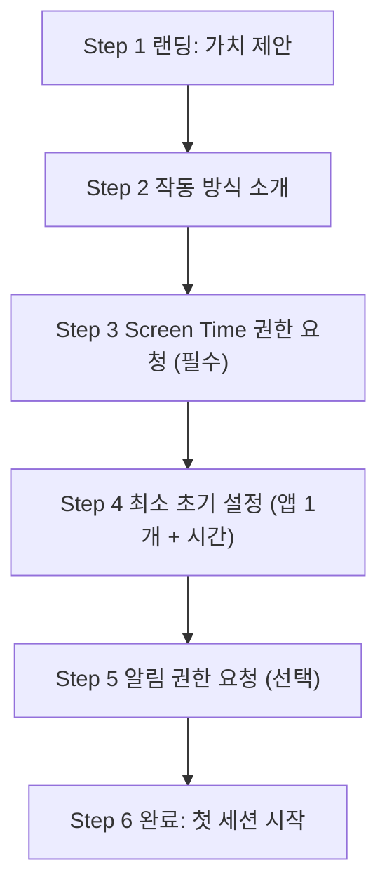

# Purpose Reminder 온보딩/권한 UX 가이드

## 1. 문서 목적
- 이 문서는 Purpose Reminder의 랜딩 페이지와 온보딩 권한 플로우를 더 이해하기 쉽고, 이탈이 적은 구조로 정리한 실행 가이드다.
- 기획/디자인/개발/QA가 같은 기준으로 화면, 문구, 상태 처리를 맞추는 데 사용한다.

## 2. 현재 플로우 진단 (요약)
- 현재 앱은 첫 화면에서 `Screen Time 권한`과 `알림 권한` 요청 카드를 바로 노출한다.
- 두 권한이 모두 허용돼야 다음으로 진행할 수 있다.
- 문제:
1. 사용자 입장에서 "왜 지금 권한이 필요한지" 이해하기 전에 요청이 시작된다.
2. 알림 권한까지 초기 필수로 묶이면 온보딩 이탈이 커진다.
3. 거부/실패 시 복구 동선(설정 이동, 재시도 안내)이 약하면 복귀율이 떨어진다.

## 3. 핵심 UX 원칙
1. 가치 설명 먼저, 권한 요청은 나중에
- 시스템 팝업 전에 "왜 필요한지"를 먼저 이해시켜야 허용률이 올라간다.
2. 필수 권한과 선택 권한 분리
- `Screen Time`은 필수, `알림`은 선택으로 처리한다.
3. 권한은 기능 직전 맥락에서 요청
- "권한이 없으면 지금 하려는 행동이 왜 막히는지"가 보이는 타이밍에 요청한다.
4. 거부 상태 복구 UX는 기본 포함
- 거부 후 재요청 불가 상태를 고려해 `설정으로 이동` 버튼과 안내 문구를 제공한다.
5. 단계 진행감을 제공
- 상단 단계 표시(`1/5`, `2/5`)와 다음 행동 CTA를 명확히 준다.

## 4. 권장 온보딩 플로우 (MVP)

### Step 1. 랜딩 (가치 제안)
- 목표: 앱의 존재 이유를 5초 안에 이해시킨다.
- 핵심 메시지: `딴짓 앱 열기 전에, 왜 여는지 먼저 정하세요.`
- CTA: `시작하기`
- 보조 CTA: `어떻게 동작하나요?`

### Step 2. 작동 방식 소개
- 목표: Shield 개입 흐름을 직관적으로 설명한다.
- 구성: `앱 선택 -> 목표 선택 -> 제한 시간 사용 -> 리마인드` 4단계 카드.
- CTA: `권한 설정 시작`

### Step 3. Screen Time 권한 요청 (필수)
- 목표: 핵심 기능에 필요한 필수 권한만 요청한다.
- 사전 설명(Pre-permission) 필수 문구:
1. 왜 필요한지: 등록한 앱 진입 전에 목표 선택 화면을 띄우기 위해 필요
2. 언제 쓰는지: 사용자가 설정한 앱을 열려고 할 때만 사용
3. 수집 범위: 개인 메시지/콘텐츠 내용은 수집하지 않음
- CTA: `Screen Time 권한 허용`
- 보조 CTA: `나중에` (선택 불가면 숨김)

### Step 4. 최소 초기 설정
- 목표: 권한 직후 바로 가치를 체감하게 만든다.
- 최소 완료 조건:
1. 대상 앱 1개 선택
2. 기본 사용 시간 1개 설정(예: 20분)
- CTA: `다음`

### Step 5. 알림 권한 요청 (선택)
- 목표: 이탈 없이 리마인드 기능을 활성화한다.
- 요청 타이밍:
1. 초기 설정 직후
2. 또는 첫 세션 시작 직전
- CTA: `리마인드 알림 켜기`
- 보조 CTA: `지금은 건너뛰기`
- 규칙: 알림 미허용이어도 메인 진입 가능해야 함

### Step 6. 완료
- 목표: 사용자가 바로 행동(첫 세션 시작)하도록 유도한다.
- CTA: `첫 목표로 시작하기`
- 보조 CTA: `정책 화면으로 이동`

## 5. 권한 화면 컴포넌트 가이드
권한 카드는 아래 4가지 요소를 고정해서 일관성 있게 사용한다.
1. 제목: `Screen Time 권한`
2. 상태 라벨: `허용됨`, `미요청`, `거부됨`
3. 설명 3줄: `왜 필요`, `언제 사용`, `거부 시 영향`
4. 액션 버튼: 상태별 동작 버튼

상태별 버튼 규칙:
1. `미요청` -> `권한 요청`
2. `거부됨` -> `설정에서 허용`
3. `허용됨` -> `허용 완료` (비활성)

## 6. 권한 상태 처리 매트릭스
| Screen Time | 알림 | 진행 가능 여부 | 사용자 안내 |
|---|---|---|---|
| 허용됨 | 허용됨 | 가능 | 정상 진입 |
| 허용됨 | 미요청/거부 | 가능 | 알림은 설정에서 언제든 활성화 가능 |
| 미요청 | 어떤 상태든 | 불가 | Screen Time 권한 먼저 필요 |
| 거부됨 | 어떤 상태든 | 불가 | 설정 앱에서 Screen Time 권한 변경 필요 |

## 7. 랜딩/온보딩 비주얼 방향
1. 톤
- "통제"보다 "목표 정렬" 느낌이 나는 차분한 생산성 톤
2. 레이아웃
- 큰 헤드라인 1개 + 핵심 카드 3개 + 단일 주 CTA
3. 카드 디자인
- 아이콘 + 한 줄 타이틀 + 한 줄 설명 구조 유지
4. 모션
- 첫 진입 시 카드 순차 등장(과하지 않은 200~300ms)
5. 진행 표시
- 상단 고정 스텝 인디케이터로 현재 위치를 항상 보여준다

## 8. 권장 카피 예시
### 랜딩
- 타이틀: `앱을 열기 전에, 목적부터 정하세요`
- 본문: `무의식 진입을 줄이고 필요한 일만 끝내도록 도와줍니다.`
- CTA: `온보딩 시작`

### Screen Time 권한 사전 안내
- 타이틀: `먼저 Screen Time 권한이 필요해요`
- 본문: `등록한 앱을 열 때 목표 선택을 먼저 보여주기 위해 사용합니다.`
- 보조 문구: `개인 콘텐츠 내용은 수집하지 않습니다.`
- CTA: `권한 허용`

### 알림 권한 사전 안내
- 타이틀: `마무리 타이밍을 놓치지 않게 도와드릴게요`
- 본문: `종료 5분 전에 리마인드 알림을 보냅니다.`
- CTA: `알림 켜기`
- 보조 CTA: `나중에`

## 9. 구현 반영 가이드 (현재 코드 기준)
아래 순서로 반영하면 리스크를 줄일 수 있다.
1. 온보딩 단계를 단일 화면에서 단계형 상태 머신으로 변경
- `OnboardingStep` enum 도입 (`landing`, `explain`, `screenTimePermission`, `initialSetup`, `notificationPermission`, `done`)
2. 권한 게이트 조건 분리
- 메인 진입 필수: `Screen Time == approved`
- 선택 기능: `Notification == authorized`는 비필수
3. 거부 상태 복구 액션 추가
- `알림`: 앱 설정 이동 버튼 추가
- `Screen Time`: 설정 이동/재확인 안내 문구 강화
4. 권한 카드 컴포넌트 공통화
- 상태 라벨/버튼/설명 3줄을 재사용 컴포넌트로 분리

## 10. QA 체크리스트
1. 첫 실행 시 랜딩 -> 단계형 온보딩이 자연스럽게 이어지는지
2. Screen Time 미허용 상태에서 메인 진입이 차단되는지
3. 알림 권한을 거부해도 메인 진입 가능한지
4. 권한 거부 후 설정 이동/복귀 플로우가 정상 동작하는지
5. 권한 허용 후 상태 라벨과 CTA가 즉시 업데이트되는지
6. 작은 화면(iPhone mini)에서 버튼/텍스트 잘림이 없는지

## 11. 측정 지표 (온보딩 개선 효과 확인)
1. 온보딩 완료율
2. Screen Time 권한 허용률
3. 알림 권한 허용률
4. 첫 세션 시작 전환율
5. 온보딩 단계별 이탈률

---
이 문서는 MVP 기준이며, 실제 사용자 테스트 결과에 따라 카피/단계 수/권한 요청 시점을 조정한다.
