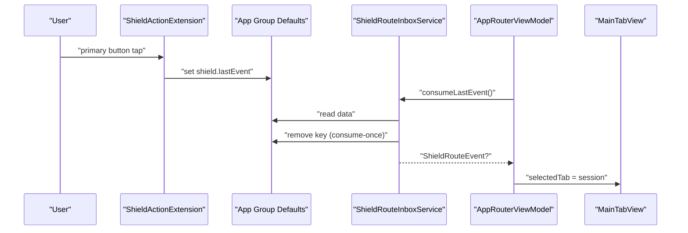
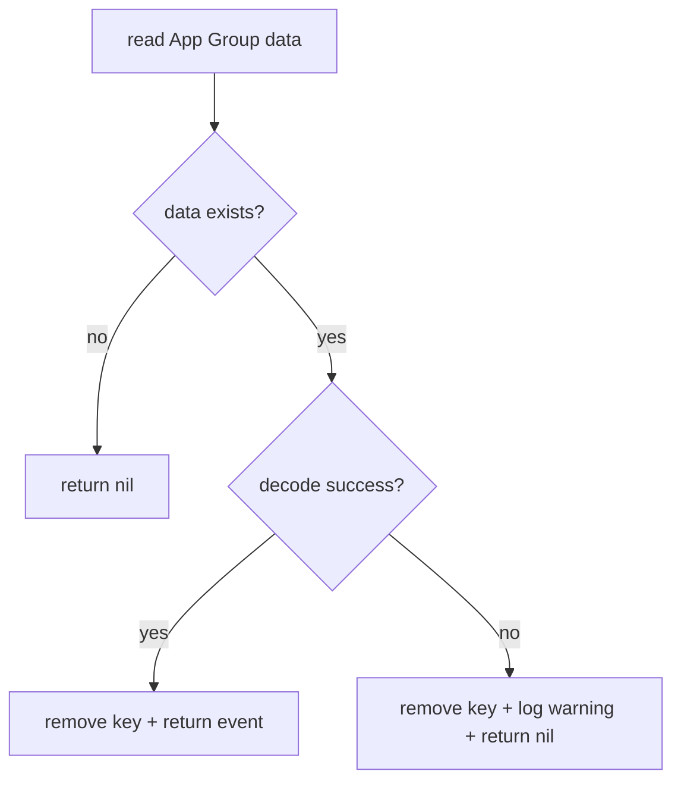

# PR-AG-016 계획 — ShieldRoute 소비 및 앱 라우팅 연결

## 0. 목적
- ShieldActionExtension이 App Group에 기록한 `shield.lastEvent`를 Main App이 consume-once로 처리해 세션 시작 동선으로 안정적으로 라우팅한다.
- 목표는 "이벤트 저장은 Extension, 소비/화면 이동은 Main App" 경계를 명확히 고정하는 것이다.

## 1. 현재 코드베이스 진단

### 1-1. 이미 구현된 부분
- 이벤트 기록 측 구현 완료
  - `Extensions/ShieldActionExtension/ShieldActionExtension.swift`
  - 저장 키: `shield.lastEvent`
  - payload 필드: `route`, `targetType`, `isPolicyManaged`, `actionAt`

### 1-2. 현재 갭
- Main App 소비 서비스 부재
  - App Group `UserDefaults(suiteName:)`를 읽는 타입이 없음
- 라우팅 상태 제어 부재
  - `App/AppRouter.swift`의 `TabView`는 외부에서 tab selection 제어 불가
- idempotent 처리 규칙 부재
  - malformed payload/중복 소비/빈 값 처리 정책 없음

## 2. 설계 결정
1. 이벤트 소비는 반드시 consume-once
   - decode 성공/실패와 무관하게 "한 번 읽은 이벤트는 삭제"한다.
2. 라우팅은 상태 객체로 분리
   - `AppRouterViewModel`을 두어 SwiftUI View 테스트 난이도를 낮춘다.
3. 라우팅 정책
   - `startGoalSelection` -> 세션 탭 선택
   - `dismissShield` -> 화면 이동 없음(로그만 남김)

## 3. 범위

### In Scope
1. App Group route inbox 서비스 구현
2. AppRouter에 route poll/처리 파이프라인 연결
3. consume-once/오류 방어 테스트 추가

### Out of Scope
- target app token 기반 상세 딥링크
- 다중 route queue(단일 lastEvent만 처리)

## 4. 파일별 변경 청사진
| 파일 | 변경 | 세부 내용 |
|---|---|---|
| `PurposeReminder/Core/Shared/Constants.swift` | 수정 | App Group suite/key 상수(`group.com.purposereminder.shared`, `shield.lastEvent`) 공통화 |
| `PurposeReminder/Core/Services/ScreenTime/ShieldRouteInboxService.swift` | 신규 | `consumeLastEvent() -> ShieldRouteEvent?`, decode/clear 로직 |
| `PurposeReminder/App/AppRouter.swift` | 수정 | `TabView(selection:)` + `AppRouterViewModel` + 앱 활성 시 route poll |
| `PurposeReminderTests/ShieldRouteInboxServiceTests.swift` | 신규 | decode 성공/실패/없음/재소비 불가 테스트 |
| `PurposeReminderTests/AppRouterViewModelTests.swift` | 신규 | `startGoalSelection`시 세션 탭 전환 테스트 |

## 4-1. 시각화 (이벤트 소비/라우팅)

## 4-2. 시각화 (오류/방어 경로)

## 5. 구현 단계 (순차 실행)
1. 상수 정리
   - 기존 Extension 하드코딩 값을 Main App에서도 동일 참조 가능하게 상수화
2. route inbox 서비스 구현
   - 입력: App Group `UserDefaults`
   - 출력: `ShieldRouteEvent?`
   - 처리: `data(forKey:)` -> decode -> 즉시 remove
3. AppRouter 상태 분리
   - `selectedTab`(예: session/history/policy) 상태 도입
   - `task` + `scenePhase == .active` 시점에 route consume
4. route 핸들링
   - `startGoalSelection`이면 `selectedTab = .session`
   - 기타 값은 무시하고 로그만 기록
5. 테스트 추가
   - route payload decode
   - consume-once idempotent
   - 라우터 상태 전환

## 6. 테스트 설계

### 자동 테스트
- `ShieldRouteInboxServiceTests`
  - `testConsumeDecodesAndClearsEvent`
  - `testConsumeReturnsNilWhenNoEvent`
  - `testConsumeClearsMalformedPayloadAndReturnsNil`
  - `testConsumeIsIdempotent`
- `AppRouterViewModelTests`
  - `testStartGoalSelectionSelectsSessionTab`
  - `testDismissShieldKeepsCurrentTab`

### 수동 테스트
1. 정책 적용된 앱 실행 -> Shield 표시
2. `목표 선택` 탭 -> Main App 복귀
3. 세션 탭 자동 선택 확인
4. 같은 이벤트로 중복 이동이 발생하지 않는지 확인

## 7. 검증 명령
- `xcodebuild -project PurposeReminder.xcodeproj -scheme PurposeReminder -destination 'platform=iOS Simulator,name=iPhone 17,OS=26.2' test -only-testing:PurposeReminderTests/ShieldRouteInboxServiceTests`
- `xcodebuild -project PurposeReminder.xcodeproj -scheme PurposeReminder -destination 'platform=iOS Simulator,name=iPhone 17,OS=26.2' test -only-testing:PurposeReminderTests/AppRouterViewModelTests`

## 8. 완료 기준 (DoD)
1. `shield.lastEvent`가 1회만 소비된다.
2. `startGoalSelection` 이벤트 발생 시 세션 탭 진입이 확인된다.
3. malformed payload에서 크래시 없이 이벤트가 정리된다.
4. 테스트 4개 이상 통과(또는 BLOCKED 사유 기록).

## 9. BLOCKED_MANUAL 조건
- `BM-016-01`: App Group 미설정으로 Main App/Extension 간 공유 UserDefaults 접근 실패

## 10. 산출물
- `ShieldRouteInboxService` 구현
- `AppRouter` 라우팅 파이프라인
- 관련 단위 테스트/검증 로그
