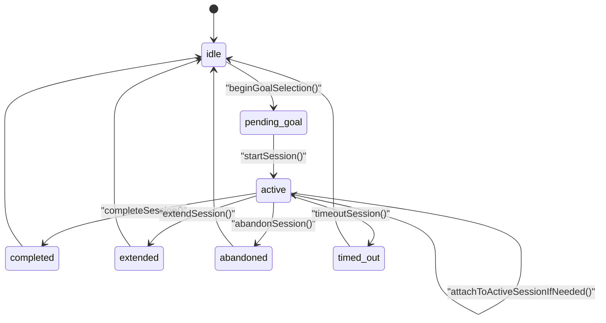
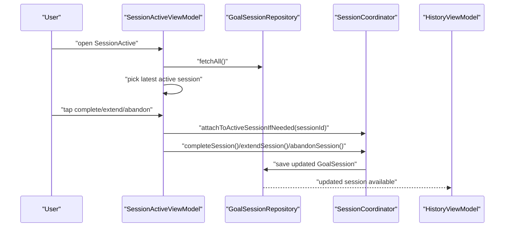

# PR-AG-017 계획 — SessionActive 화면 및 종료 액션 구현

## 0. 목적
- 진행 중 세션을 확인하고 `완료/연장/중단` 액션으로 세션 lifecycle을 닫는 화면을 구현한다.
- 앱 재실행 후에도 active 세션을 다시 붙어서 종료할 수 있게 "cold-start 복구 경로"를 만든다.

## 1. 현재 코드베이스 진단

### 1-1. 이미 구현된 부분
- 상태 전이 엔진 존재: `Core/Services/Session/SessionCoordinator.swift`
  - `completeSession`, `extendSession`, `abandonSession`, `timeoutSession` 제공
- 기록 반영 화면 존재: `Features/History/HistoryView.swift`

### 1-2. 현재 갭
- `Features/SessionActive/SessionActiveView.swift`가 플레이스홀더
- 세션 종료 액션 UI 없음
- 핵심 제약: `SessionCoordinator`는 인스턴스 재생성 시 `state = .idle`
  - 즉, persisted active 세션이 있어도 바로 종료 액션 호출 불가

## 2. 설계 결정
1. 종료 액션은 저장소 직접 수정이 아니라 `SessionCoordinator`를 통해 수행한다.
2. `SessionCoordinator`에 active 세션 attach/restore API를 추가한다.
3. active 세션 조회는 기존 `GoalSessionRepository.fetchAll()` 결과를 필터링해 해결한다.
   - 프로토콜 시그니처를 늘리지 않아 기존 테스트 스텁 파급을 줄인다.

## 3. 범위

### In Scope
1. SessionActiveView + SessionActiveViewModel 구현
2. active 세션 조회/남은 시간 카운트다운
3. complete/extend/abandon 액션 처리
4. coordinator cold-start attach/restore API 추가
5. SessionStart에서 SessionActive 진입 동선 추가

### Out of Scope
- Live Activity/Widget 연동
- 백그라운드 실시간 타이머 정밀 동기화

## 4. 파일별 변경 청사진
| 파일 | 변경 | 세부 내용 |
|---|---|---|
| `PurposeReminder/Core/Services/Session/SessionCoordinator.swift` | 수정 | `attachToActiveSessionIfNeeded(sessionId:)` 추가 |
| `PurposeReminder/Features/SessionActive/SessionActiveView.swift` | 교체 | View + ViewModel + 액션 핸들러 + 카운트다운 |
| `PurposeReminder/Features/SessionStart/SessionStartView.swift` | 수정 | active 세션 존재 시 SessionActive 진입 버튼 |
| `PurposeReminderTests/SessionActiveViewModelTests.swift` | 신규 | 로드/카운트다운/완료/연장/중단 테스트 |
| `PurposeReminderTests/SessionCoordinatorTests.swift` | 수정 | cold-start attach 후 종료 액션 테스트 |

## 4-1. 시각화 (상태 전이 + 복구)

## 4-2. 시각화 (화면 액션 흐름)

## 5. 구현 단계 (순차 실행)
1. `SessionCoordinator` 확장
   - `attachToActiveSessionIfNeeded(sessionId:)` 구현
   - 이미 `.active/.reminded(sessionId)`면 no-op
   - `.idle/.pendingGoal`이면 저장소 조회 후 active 확인 뒤 상태 attach
2. SessionActiveViewModel 구현
   - load 시 active 세션 1개 선택(최신 startedAt 기준)
   - 1초 주기 타이머로 남은 시간 갱신
   - 액션 호출 전 `attachToActiveSessionIfNeeded` 실행
3. 액션 처리 정책
   - 완료 -> `.completed`
   - 연장 -> `.extended` + `Constants.Session.extensionDurationMinutes`
   - 중단 -> `.abandoned`
   - 성공 시 성공 메시지 표출 후 active 세션 상태 갱신
4. 진입 동선 연결
   - SessionStart 화면에서 active 세션 존재 시 SessionActive 이동 경로 제공
5. 테스트 추가
   - 액션별 status 검증
   - attach 실패/active 없음 경로 검증

## 6. 테스트 설계

### 자동 테스트
- `SessionActiveViewModelTests`
  - `testLoadShowsLatestActiveSession`
  - `testCompleteUpdatesStatusToCompleted`
  - `testExtendUsesDefaultExtensionMinutes`
  - `testAbandonUpdatesStatusToAbandoned`
  - `testLoadHandlesNoActiveSession`
- `SessionCoordinatorTests` 보강
  - `testAttachToActiveSessionFromIdleThenComplete`
  - `testAttachFailsWhenSessionAlreadyEnded`

### 수동 테스트
1. SessionStart에서 세션 시작
2. SessionActive 화면 진입
3. 완료/연장/중단 각각 실행
4. History 화면에서 상태 반영 확인

## 7. 검증 명령
- `xcodebuild -project PurposeReminder.xcodeproj -scheme PurposeReminder -destination 'platform=iOS Simulator,name=iPhone 17,OS=26.2' test -only-testing:PurposeReminderTests/SessionActiveViewModelTests`
- `xcodebuild -project PurposeReminder.xcodeproj -scheme PurposeReminder -destination 'platform=iOS Simulator,name=iPhone 17,OS=26.2' test -only-testing:PurposeReminderTests/SessionCoordinatorTests`

## 8. 완료 기준 (DoD)
1. SessionActive 플레이스홀더 제거
2. 완료/연장/중단 액션이 저장소 상태로 정확히 반영
3. 앱 재실행 후 active 세션 attach 후 종료 액션 가능
4. 관련 테스트 5개 이상 통과

## 9. BLOCKED_MANUAL 조건
- 없음

## 10. 산출물
- SessionActive 화면/뷰모델 구현
- SessionCoordinator attach/restore 로직
- 테스트 및 검증 로그
