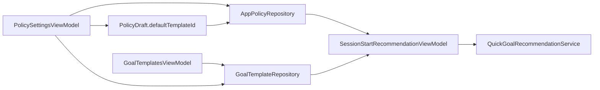
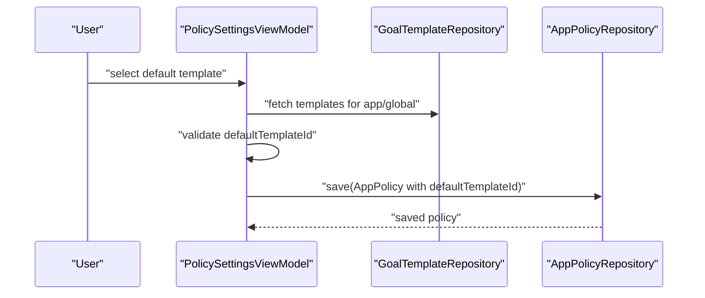

# PR-AG-018 계획 — GoalTemplates 화면 및 정책 기본 템플릿 연결

## 0. 목적
- `GoalTemplate`를 사용자가 직접 관리(CRUD/즐겨찾기)할 수 있는 화면을 구현한다.
- 정책 화면에서 `defaultTemplateId`를 선택/저장/복원할 수 있게 연결한다.

## 1. 현재 코드베이스 진단

### 1-1. 이미 구현된 부분
- 모델/저장소 준비 완료
  - `Core/Models/GoalTemplate.swift`
  - `Core/Storage/Repositories/GoalTemplateRepository.swift`
  - `Core/Storage/Repositories/SwiftDataGoalTemplateRepository.swift`
- 정책 모델에 `defaultTemplateId` 존재
  - `Core/Models/AppPolicy.swift`
  - `Features/PolicySettings/PolicySettingsView.swift`의 `PolicyDraft.defaultTemplateId`
- SessionStart 추천 로직이 `defaultTemplateId`를 이미 참조
  - `Core/Services/Session/QuickGoalRecommendationService.swift`

### 1-2. 현재 갭
- `Features/GoalTemplates/GoalTemplatesView.swift` 플레이스홀더
- PolicySettings UI에서 `defaultTemplateId` 선택 경로 없음
- 템플릿 유효성 정책(공백/중복/삭제 후 dangling default) 미정

## 2. 설계 결정
1. 템플릿 정렬 우선순위
   - 즐겨찾기 우선 -> 최근 사용 -> useCount -> 생성일
2. 텍스트 유효성
   - trim 후 빈 문자열 금지
   - 동일 앱 범위(같은 `targetAppTokenData`) 내 중복 텍스트 금지
3. 정책 기본 템플릿 후보
   - 공용 템플릿(`targetAppTokenData == nil`) + 해당 앱 템플릿만 노출
4. dangling `defaultTemplateId` 처리
   - 저장 시 템플릿이 존재하지 않으면 `nil`로 정리

## 3. 범위

### In Scope
1. GoalTemplatesView + ViewModel 구현
2. 템플릿 생성/수정/삭제/즐겨찾기
3. PolicySettings 기본 템플릿 picker 연결
4. 템플릿/정책 연동 테스트

### Out of Scope
- AI 문구 자동 생성
- 템플릿 공유/동기화(CloudKit 등)

## 4. 파일별 변경 청사진
| 파일 | 변경 | 세부 내용 |
|---|---|---|
| `PurposeReminder/Features/GoalTemplates/GoalTemplatesView.swift` | 교체 | GoalTemplatesView + GoalTemplatesViewModel |
| `PurposeReminder/Features/PolicySettings/PolicySettingsView.swift` | 수정 | templateRepository 주입, draft별 defaultTemplate picker |
| `PurposeReminder/Features/SessionStart/SessionStartView.swift` | 수정 | 템플릿 관리 화면 진입 링크(toolbar/nav) |
| `PurposeReminderTests/GoalTemplatesViewModelTests.swift` | 신규 | CRUD/중복 방지/즐겨찾기 테스트 |
| `PurposeReminderTests/PolicySettingsViewModelTests.swift` | 신규 | defaultTemplateId 저장/복원/정리 테스트 |

## 4-1. 시각화 (데이터 연결)

## 4-2. 시각화 (기본 템플릿 저장 시퀀스)

## 5. 구현 단계 (순차 실행)
1. GoalTemplatesViewModel 작성
   - `load()`, `createTemplate`, `updateTemplate`, `deleteTemplate`, `toggleFavorite`
   - 정렬/유효성 규칙 구현
2. GoalTemplatesView 작성
   - 목록/폼/편집/삭제 UI
   - 공용/앱별 필터 UI(세그먼트 또는 section)
3. PolicySettings 확장
   - ViewModel에 `GoalTemplateRepository` 주입
   - draft별 template 후보 계산
   - picker 선택값을 `defaultTemplateId`로 저장
4. dangling default 정리
   - save 시 템플릿 존재성 확인 후 없으면 `nil`
5. SessionStart 진입 동선
   - 템플릿 화면에 접근 가능한 네비게이션 추가
6. 테스트 추가

## 6. 테스트 설계

### 자동 테스트
- `GoalTemplatesViewModelTests`
  - `testLoadSortsFavoritesAndRecency`
  - `testCreateTemplateRejectsBlankText`
  - `testCreateTemplateRejectsDuplicateInSameScope`
  - `testToggleFavoritePersists`
  - `testDeleteRemovesTemplate`
- `PolicySettingsViewModelTests`
  - `testSavePersistsDefaultTemplateId`
  - `testLoadRestoresDefaultTemplateId`
  - `testSaveClearsDanglingDefaultTemplateId`

### 수동 테스트
1. 템플릿 3개 생성(공용 1, 앱별 2)
2. 정책 화면에서 앱별 기본 템플릿 선택 후 저장
3. 앱 재진입 후 선택값 복원 확인
4. 선택된 템플릿 삭제 후 정책 저장 시 기본 템플릿이 해제되는지 확인

## 7. 검증 명령
- `xcodebuild -project PurposeReminder.xcodeproj -scheme PurposeReminder -destination 'platform=iOS Simulator,name=iPhone 17,OS=26.2' test -only-testing:PurposeReminderTests/GoalTemplatesViewModelTests`
- `xcodebuild -project PurposeReminder.xcodeproj -scheme PurposeReminder -destination 'platform=iOS Simulator,name=iPhone 17,OS=26.2' test -only-testing:PurposeReminderTests/PolicySettingsViewModelTests`

## 8. 완료 기준 (DoD)
1. GoalTemplates 플레이스홀더 제거
2. CRUD/즐겨찾기 동작 및 유효성 규칙 적용
3. 정책 화면에서 `defaultTemplateId` 저장/복원 확인
4. 관련 테스트 6개 이상 통과

## 9. BLOCKED_MANUAL 조건
- 없음

## 10. 산출물
- GoalTemplates 화면/뷰모델
- Policy default template 연동 코드
- 연동 테스트/검증 로그
