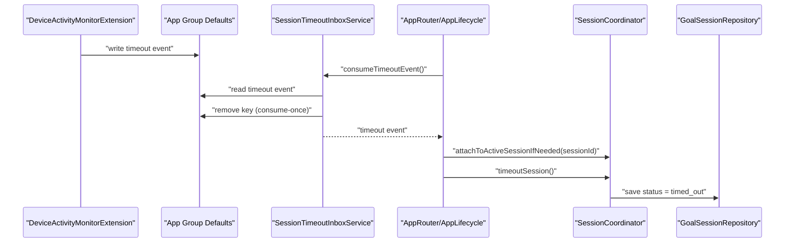
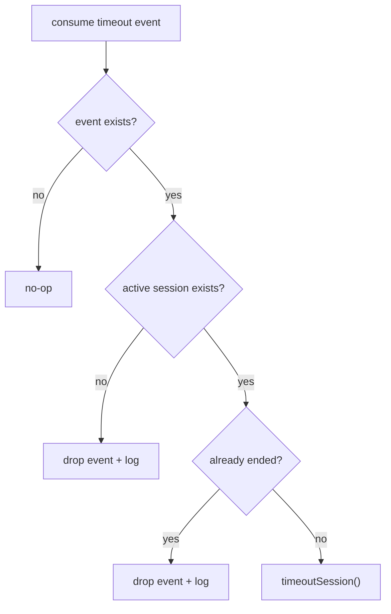

# PR-AG-019 계획 — DeviceActivityMonitorExtension 타임아웃 처리 구현

## 0. 목적
- DeviceActivity interval 종료 이벤트를 사용해 active 세션을 자동으로 `timed_out` 전환한다.
- Extension과 Main App 간 timeout 브리지를 consume-once 방식으로 고정한다.

## 1. 현재 코드베이스 진단

### 1-1. 이미 구현된 부분
- `SessionCoordinator.timeoutSession()` 구현 완료
  - `Core/Services/Session/SessionCoordinator.swift`
- History 집계에 `timedOut` 표시 경로 존재
  - `Features/History/HistoryView.swift`

### 1-2. 현재 갭
- `Extensions/DeviceActivityMonitorExtension/DeviceActivityMonitorExtension.swift` 플레이스홀더
- timeout 이벤트를 Main App으로 전달하는 App Group inbox 서비스 없음
- timeout 이벤트와 active 세션 종료 액션 연결 경로 없음

## 2. 설계 결정
1. Extension은 "상태 변경"이 아니라 "이벤트 기록"만 수행한다.
   - SwiftData 직접 접근 없이 App Group 이벤트만 기록
2. Main App이 consume-once로 timeout 이벤트를 가져와 세션 상태를 업데이트한다.
3. active 세션이 없으면 이벤트는 무시하고 삭제한다(idempotent).
4. `PR-AG-017`의 coordinator attach API를 재사용한다.

## 3. 범위

### In Scope
1. DeviceActivityMonitorExtension 이벤트 핸들러 구현
2. timeout App Group inbox 서비스 구현
3. timeout 이벤트 소비 -> `timeoutSession()` 연결
4. 자동 테스트(이벤트 소비/상태 반영) 추가

### Out of Scope
- 다중 세션 동시 timeout 세분화 정책
- 백그라운드 고급 스케줄 재동기화

## 4. 파일별 변경 청사진
| 파일 | 변경 | 세부 내용 |
|---|---|---|
| `PurposeReminder/Extensions/DeviceActivityMonitorExtension/DeviceActivityMonitorExtension.swift` | 교체 | `DeviceActivityMonitor` override + timeout 이벤트 기록 |
| `PurposeReminder/Core/Shared/Constants.swift` | 수정 | timeout App Group key 상수 추가 |
| `PurposeReminder/Core/Services/Session/SessionTimeoutInboxService.swift` | 신규 | timeout decode/consume-once |
| `PurposeReminder/App/AppRouter.swift` 또는 lifecycle 진입점 | 수정 | 앱 활성 시 timeout 이벤트 처리 트리거 |
| `PurposeReminderTests/SessionTimeoutInboxServiceTests.swift` | 신규 | decode/clear/idempotent 테스트 |
| `PurposeReminderTests/SessionTimeoutFlowTests.swift` | 신규 | timeout 이벤트 -> session.status=.timedOut 테스트 |

## 4-1. 시각화 (Timeout 브리지)

## 4-2. 시각화 (중복/예외 방어)

## 5. 구현 단계 (순차 실행)
1. timeout 이벤트 모델 정의
   - 필드 예시: `activityName`, `occurredAt`, `reason`
2. Extension 구현
   - `intervalDidEnd(for:)`에서 App Group 키에 JSON 저장
   - 저장 실패 시 로그만 기록하고 종료
3. Main App inbox 서비스 구현
   - `consumeTimeoutEvent()`로 decode 후 즉시 key 삭제
4. timeout 적용 로직 연결
   - 이벤트 존재 시 active 세션 조회
   - `attachToActiveSessionIfNeeded(sessionId:)` 후 `timeoutSession()`
   - active 세션 없음/이미 종료면 no-op
5. 테스트 추가
   - 이벤트 소비 테스트
   - timeout 상태 반영 테스트

## 6. 테스트 설계

### 자동 테스트
- `SessionTimeoutInboxServiceTests`
  - `testConsumeDecodesAndClearsTimeoutEvent`
  - `testConsumeReturnsNilWhenEventMissing`
  - `testConsumeClearsMalformedPayload`
- `SessionTimeoutFlowTests`
  - `testTimeoutEventMarksLatestActiveSessionTimedOut`
  - `testTimeoutEventIgnoredWhenNoActiveSession`
  - `testDuplicateTimeoutEventNotAppliedTwice`

### 수동 테스트
1. 실기기에서 DeviceActivity interval 종료 조건 발생
2. 앱 재진입/활성화
3. 해당 세션 status가 `timed_out`인지 확인
4. History의 시간초과 카운트 증가 확인

## 7. 검증 명령
- `xcodebuild -project PurposeReminder.xcodeproj -scheme PurposeReminder -destination 'platform=iOS Simulator,name=iPhone 17,OS=26.2' test -only-testing:PurposeReminderTests/SessionTimeoutInboxServiceTests`
- `xcodebuild -project PurposeReminder.xcodeproj -scheme PurposeReminder -destination 'platform=iOS Simulator,name=iPhone 17,OS=26.2' test -only-testing:PurposeReminderTests/SessionTimeoutFlowTests`

## 8. 완료 기준 (DoD)
1. DeviceActivityMonitor 플레이스홀더 제거
2. timeout 이벤트가 consume-once로 처리됨
3. active 세션 timeout 상태 반영 확인
4. History 집계에 시간초과 반영
5. 테스트 5개 이상 통과

## 9. BLOCKED_MANUAL 조건
- `BM-019-01`: DeviceActivity capability/entitlement 미설정
- `BM-019-02`: Extension 타깃 signing 또는 실기기 실행 검증 불가

## 10. 산출물
- DeviceActivity timeout 이벤트 기록 코드
- timeout inbox/적용 서비스
- 자동 테스트 + 수동 검증 로그
