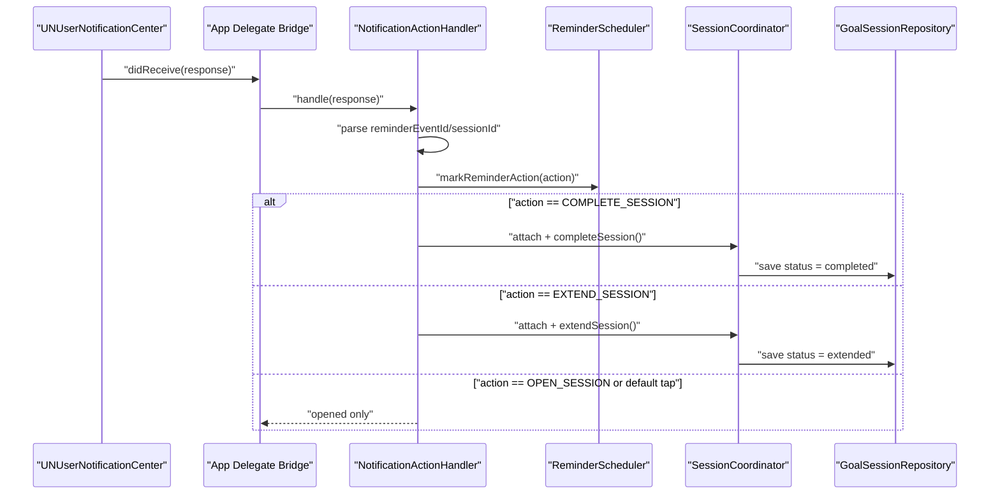
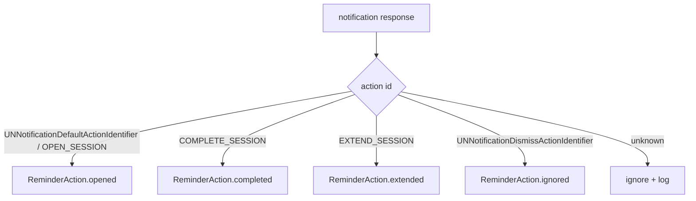
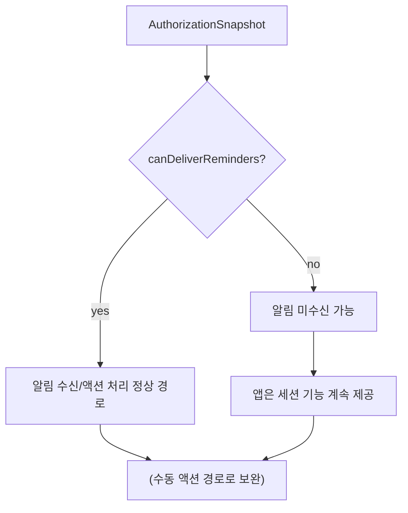

# PR-AG-020 계획 — 알림 액션 파이프라인 구현

## 0. 목적
- 리마인드 알림 응답(열기/완료/연장/닫기)을 `ReminderEvent.action`으로 일관되게 저장한다.
- 완료/연장 액션은 실제 세션 상태 전이까지 연결한다.

## 1. 현재 코드베이스 진단

### 1-1. 이미 구현된 부분
- 알림 예약 payload 준비 완료
  - `Core/Services/Session/ReminderScheduler.swift`
  - `categoryIdentifier`, `userInfo(sessionId, reminderEventId)` 설정
- 리마인드 이벤트 갱신 API 존재
  - `markReminderAction(reminderEventId:action:)`

### 1-2. 현재 갭
- 앱 시작 시 notification category/action 등록이 없음
- `UNUserNotificationCenterDelegate` 응답 처리 경로 없음
- `PurposeReminderApp`는 delegate bridge 없이 `AppRouter()`만 렌더링
- Action ID 상수가 `OPEN_SESSION` 단일 값만 존재

## 2. 설계 결정
1. 액션 매핑 정책
   - `UNNotificationDefaultActionIdentifier` 또는 `OPEN_SESSION` -> `.opened`
   - `COMPLETE_SESSION` -> `.completed`
   - `EXTEND_SESSION` -> `.extended`
   - `UNNotificationDismissActionIdentifier` -> `.ignored`
2. malformed payload는 무시하고 로그만 남긴다(크래시 금지).
3. 완료/연장 액션은 `PR-AG-017`의 coordinator attach API로 실제 세션 상태도 변경한다.
4. ReminderEvent 저장 실패와 세션 상태 변경 실패를 분리 기록한다(부분 실패 허용).

## 3. 범위

### In Scope
1. 알림 카테고리/액션 상수 확장
2. 앱 시작 시 category 등록
3. 알림 응답 핸들러(service + delegate bridge) 구현
4. 액션별 `ReminderEvent.action` 저장
5. complete/extend 액션 시 세션 상태 반영
6. 파싱/매핑/실패 안전 테스트

### Out of Scope
- 리치 알림 커스텀 UI
- 서버 푸시 알림 연동

## 4. 파일별 변경 청사진
| 파일 | 변경 | 세부 내용 |
|---|---|---|
| `PurposeReminder/Core/Shared/Constants.swift` | 수정 | `OPEN_SESSION`, `COMPLETE_SESSION`, `EXTEND_SESSION` 상수 추가 |
| `PurposeReminder/Core/Services/Notification/NotificationActionHandler.swift` | 신규 | userInfo 파싱 + 액션 매핑 + ReminderEvent/Session 연계 |
| `PurposeReminder/App/PurposeReminderApp.swift` | 수정 | `UIApplicationDelegateAdaptor` + category 등록 + delegate 연결 |
| `PurposeReminder/Core/Services/Session/ReminderScheduler.swift` | 선택 수정 | 필요 시 helper(파싱 키 상수 정리) |
| `PurposeReminderTests/NotificationActionHandlerTests.swift` | 신규 | 매핑/파싱/실패 안전/complete-extend 반영 테스트 |

## 4-1. 시각화 (알림 액션 처리 시퀀스)


## 4-2. 시각화 (액션 매핑 규칙)


## 4-3. 인터페이스 초안 (코드 수정 직전)
```swift
// Core/Services/Notification/NotificationActionHandler.swift
@MainActor
protocol NotificationActionHandling {
    func registerCategories()
    func handle(response: UNNotificationResponse) async
}

@MainActor
final class NotificationActionHandler: NotificationActionHandling {
    func registerCategories()
    func handle(response: UNNotificationResponse) async
}

// App/PurposeReminderApp.swift
final class NotificationDelegateBridge: NSObject, UNUserNotificationCenterDelegate {
    func userNotificationCenter(
        _ center: UNUserNotificationCenter,
        didReceive response: UNNotificationResponse
    ) async
}
```

## 4-4. 시각화 (권한 상태와 처리)


## 5. 구현 단계 (순차 실행)
1. 상수 확장
   - category/action 식별자와 userInfo key를 상수로 정리
2. `NotificationActionHandler` 구현
   - `handle(response:) async` 작성
   - `reminderEventId`, `sessionId` 파싱
   - 액션 매핑 후 `markReminderAction` 호출
   - complete/extend는 coordinator attach 후 상태 전이
3. App lifecycle 연결
   - `PurposeReminderApp`에 delegate bridge 추가
   - `UNUserNotificationCenter.current().setNotificationCategories(...)`
   - `didReceive response`에서 handler 호출
   - 알림 권한 미승인 상태에서도 앱 부팅/세션 기능은 정상 동작 유지
4. 방어 로직
   - 알 수 없는 action ID는 무시
   - UUID 파싱 실패는 무시 + 로그
5. 테스트 추가

## 6. 테스트 설계

### 자동 테스트
- `NotificationActionHandlerTests`
  - `testDefaultTapMapsToOpened`
  - `testDismissMapsToIgnored`
  - `testCompleteActionMarksReminderAndCompletesSession`
  - `testExtendActionMarksReminderAndExtendsSession`
  - `testMalformedUserInfoDoesNotCrash`
  - `testUnknownActionIsIgnoredSafely`

### 수동 테스트
1. 세션 시작 후 리마인드 알림 대기
2. 알림 본문 탭 -> opened 기록 확인
3. 완료 액션 -> completed + 세션 완료 상태 확인
4. 연장 액션 -> extended + 세션 연장 상태 확인
5. 알림 닫기 -> ignored 기록 확인

## 7. 검증 명령
- `xcodebuild -project PurposeReminder.xcodeproj -scheme PurposeReminder -destination 'platform=iOS Simulator,name=iPhone 17,OS=26.2' test -only-testing:PurposeReminderTests/NotificationActionHandlerTests`
- `xcodebuild -project PurposeReminder.xcodeproj -scheme PurposeReminder -destination 'platform=iOS Simulator,name=iPhone 17,OS=26.2' test -only-testing:PurposeReminderTests/ReminderSchedulerTests`

## 8. 완료 기준 (DoD)
1. 알림 카테고리/액션이 앱 시작 시 등록된다.
2. 액션별 `ReminderEvent.action`이 기대값으로 저장된다.
3. 완료/연장 액션 시 세션 status 반영이 확인된다.
4. malformed payload에서도 앱 크래시가 없다.
5. 테스트 6개 이상 통과

## 9. BLOCKED_MANUAL 조건
- `BM-020-01`: 실기기 알림 액션 수동 테스트 불가

## 10. 산출물
- NotificationActionHandler + delegate 브리지 코드
- 상수/카테고리 등록 코드
- 알림 액션 테스트/수동 검증 로그
